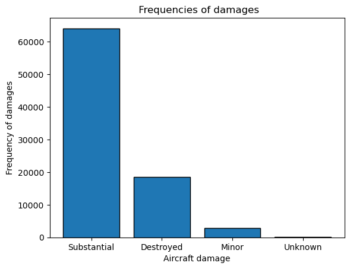
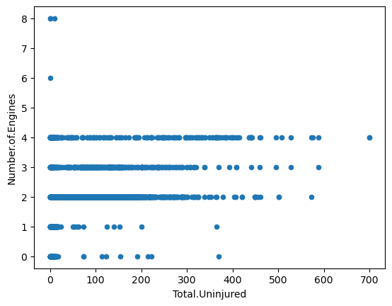
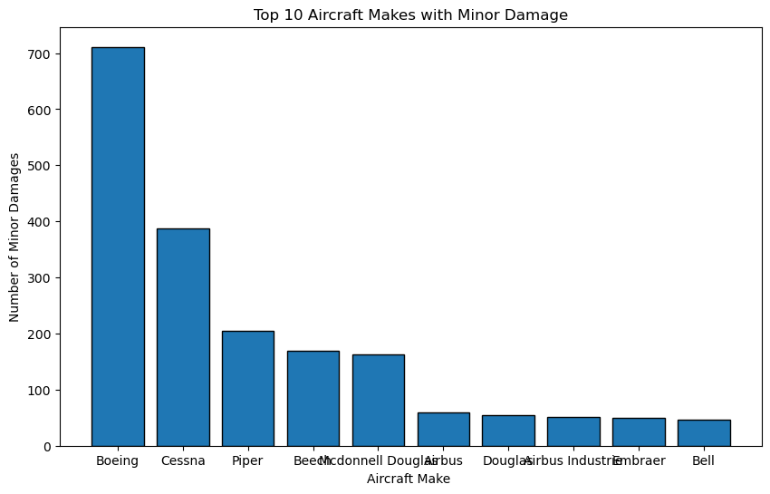
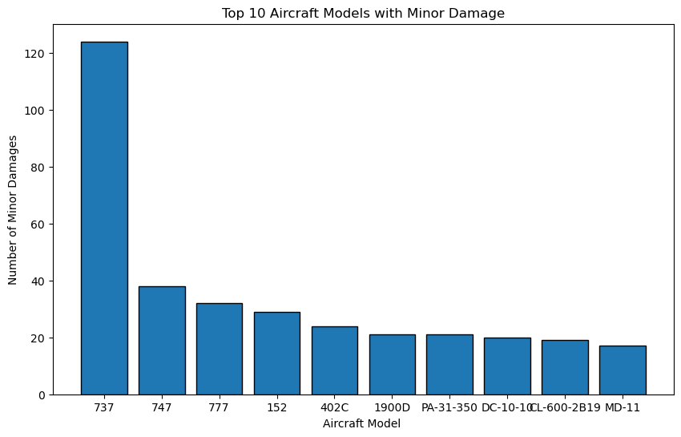

#  Cleared for Takeoff: A Data-Driven Risk Analysis for Strategic Aircraft Acquisition


## Overview
This project aims at analyzing data from the National Transportation Safety Board [Aviation accident database](https://www.kaggle.com/datasets/khsamaha/aviation-accident-database-synopses), which contains aviation accident records from 1962 to 2023, within the United States, its territories and possessions, and in international waters. The primary objective is to assess the safety of various aircraft to ensure our clients make well-informed and risk-conscious purchasing decisions as they expand into the aviation sector.


## Business Understanding
Our client is seeking to broaden their investment portfolio by entering new markets. They are particularly interested in acquiring and managing aircraft for both commercial and private use. As a data analyst, my objective is to identify the safest and most reliable aircraft options to support the company's entry into this aviation venture.


## Data Understanding
The dataset used in this analysis is sourced from Kaggle: [Aviation Accident Database & Synopses (up to 2023)](https://www.kaggle.com/datasets/khsamaha/aviation-accident-database-synopses). It contains detailed records of aviation accidents investigated by the U.S. National Transportation Safety Board (NTSB) from 1962 to 2023. This information allows for a comprehensive analysis of accident patterns, helping us determine which aircraft types have the lowest risk profiles. Specifically, we will assess factors such as the number of engines, aircraft condition prior to takeoff, and geographical locations with higher accident frequencies. The goal is to identify trends and safety indicators that can guide the company in selecting safer aircraft for commercial and private operations.


```python
# import pandas to load the data and create dataframes, we use pandas methods to inspect the shape and other attributes of these data frames
import pandas as pd
```


```python
#used encoding latin1 because maybe our data contains special characters that cannot be read with 'utf-8'
#load the csv file using alias pd
aircraft_data = pd.read_csv('AviationData.csv', encoding = 'latin1', low_memory=False)# tells pandas to read the whole file first then determine the best datatype for each column
aircraft_data.head()
```


<div>
<style scoped>
    .dataframe tbody tr th:only-of-type {
        vertical-align: middle;
    }

    .dataframe tbody tr th {
        vertical-align: top;
    }

    .dataframe thead th {
        text-align: right;
    }
</style>
<table border="1" class="dataframe">
  <thead>
    <tr style="text-align: right;">
      <th></th>
      <th>Event.Id</th>
      <th>Investigation.Type</th>
      <th>Accident.Number</th>
      <th>Event.Date</th>
      <th>Location</th>
      <th>Country</th>
      <th>Latitude</th>
      <th>Longitude</th>
      <th>Airport.Code</th>
      <th>Airport.Name</th>
      <th>...</th>
      <th>Purpose.of.flight</th>
      <th>Air.carrier</th>
      <th>Total.Fatal.Injuries</th>
      <th>Total.Serious.Injuries</th>
      <th>Total.Minor.Injuries</th>
      <th>Total.Uninjured</th>
      <th>Weather.Condition</th>
      <th>Broad.phase.of.flight</th>
      <th>Report.Status</th>
      <th>Publication.Date</th>
    </tr>
  </thead>
  <tbody>
    <tr>
      <th>0</th>
      <td>20001218X45444</td>
      <td>Accident</td>
      <td>SEA87LA080</td>
      <td>1948-10-24</td>
      <td>MOOSE CREEK, ID</td>
      <td>United States</td>
      <td>NaN</td>
      <td>NaN</td>
      <td>NaN</td>
      <td>NaN</td>
      <td>...</td>
      <td>Personal</td>
      <td>NaN</td>
      <td>2.0</td>
      <td>0.0</td>
      <td>0.0</td>
      <td>0.0</td>
      <td>UNK</td>
      <td>Cruise</td>
      <td>Probable Cause</td>
      <td>NaN</td>
    </tr>
    <tr>
      <th>1</th>
      <td>20001218X45447</td>
      <td>Accident</td>
      <td>LAX94LA336</td>
      <td>1962-07-19</td>
      <td>BRIDGEPORT, CA</td>
      <td>United States</td>
      <td>NaN</td>
      <td>NaN</td>
      <td>NaN</td>
      <td>NaN</td>
      <td>...</td>
      <td>Personal</td>
      <td>NaN</td>
      <td>4.0</td>
      <td>0.0</td>
      <td>0.0</td>
      <td>0.0</td>
      <td>UNK</td>
      <td>Unknown</td>
      <td>Probable Cause</td>
      <td>19-09-1996</td>
    </tr>
    <tr>
      <th>2</th>
      <td>20061025X01555</td>
      <td>Accident</td>
      <td>NYC07LA005</td>
      <td>1974-08-30</td>
      <td>Saltville, VA</td>
      <td>United States</td>
      <td>36.922223</td>
      <td>-81.878056</td>
      <td>NaN</td>
      <td>NaN</td>
      <td>...</td>
      <td>Personal</td>
      <td>NaN</td>
      <td>3.0</td>
      <td>NaN</td>
      <td>NaN</td>
      <td>NaN</td>
      <td>IMC</td>
      <td>Cruise</td>
      <td>Probable Cause</td>
      <td>26-02-2007</td>
    </tr>
    <tr>
      <th>3</th>
      <td>20001218X45448</td>
      <td>Accident</td>
      <td>LAX96LA321</td>
      <td>1977-06-19</td>
      <td>EUREKA, CA</td>
      <td>United States</td>
      <td>NaN</td>
      <td>NaN</td>
      <td>NaN</td>
      <td>NaN</td>
      <td>...</td>
      <td>Personal</td>
      <td>NaN</td>
      <td>2.0</td>
      <td>0.0</td>
      <td>0.0</td>
      <td>0.0</td>
      <td>IMC</td>
      <td>Cruise</td>
      <td>Probable Cause</td>
      <td>12-09-2000</td>
    </tr>
    <tr>
      <th>4</th>
      <td>20041105X01764</td>
      <td>Accident</td>
      <td>CHI79FA064</td>
      <td>1979-08-02</td>
      <td>Canton, OH</td>
      <td>United States</td>
      <td>NaN</td>
      <td>NaN</td>
      <td>NaN</td>
      <td>NaN</td>
      <td>...</td>
      <td>Personal</td>
      <td>NaN</td>
      <td>1.0</td>
      <td>2.0</td>
      <td>NaN</td>
      <td>0.0</td>
      <td>VMC</td>
      <td>Approach</td>
      <td>Probable Cause</td>
      <td>16-04-1980</td>
    </tr>
  </tbody>
</table>
<p>5 rows × 31 columns</p>
</div>


```python
#Check the data types for each columns
aircraft_data.info()
```

    <class 'pandas.core.frame.DataFrame'>
    RangeIndex: 88889 entries, 0 to 88888
    Data columns (total 31 columns):
     #   Column                  Non-Null Count  Dtype  
    ---  ------                  --------------  -----  
     0   Event.Id                88889 non-null  object 
     1   Investigation.Type      88889 non-null  object 
     2   Accident.Number         88889 non-null  object 
     3   Event.Date              88889 non-null  object 
     4   Location                88837 non-null  object 
     5   Country                 88663 non-null  object 
     6   Latitude                34382 non-null  object 
     7   Longitude               34373 non-null  object 
     8   Airport.Code            50132 non-null  object 
     9   Airport.Name            52704 non-null  object 
     10  Injury.Severity         87889 non-null  object 
     11  Aircraft.damage         85695 non-null  object 
     12  Aircraft.Category       32287 non-null  object 
     13  Registration.Number     87507 non-null  object 
     14  Make                    88826 non-null  object 
     15  Model                   88797 non-null  object 
     16  Amateur.Built           88787 non-null  object 
     17  Number.of.Engines       82805 non-null  float64
     18  Engine.Type             81793 non-null  object 
     19  FAR.Description         32023 non-null  object 
     20  Schedule                12582 non-null  object 
     21  Purpose.of.flight       82697 non-null  object 
     22  Air.carrier             16648 non-null  object 
     23  Total.Fatal.Injuries    77488 non-null  float64
     24  Total.Serious.Injuries  76379 non-null  float64
     25  Total.Minor.Injuries    76956 non-null  float64
     26  Total.Uninjured         82977 non-null  float64
     27  Weather.Condition       84397 non-null  object 
     28  Broad.phase.of.flight   61724 non-null  object 
     29  Report.Status           82505 non-null  object 
     30  Publication.Date        75118 non-null  object 
    dtypes: float64(5), object(26)
    memory usage: 21.0+ MB
    

# Info analysis
From the information above, the dataset contains a total of 88,889 entries and 31 columns. By reviewing an overview of the data, we can identify which columns contain null values and make informed decisions on which ones to retain or drop.
Now check the relevance of each column to our goal.


```python
# checking for the percentage of null values in each column
aircraft_data.isna().mean()*100
```


    Event.Id                   0.000000
    Investigation.Type         0.000000
    Accident.Number            0.000000
    Event.Date                 0.000000
    Location                   0.058500
    Country                    0.254250
    Latitude                  61.320298
    Longitude                 61.330423
    Airport.Code              43.601570
    Airport.Name              40.708074
    Injury.Severity            1.124999
    Aircraft.damage            3.593246
    Aircraft.Category         63.677170
    Registration.Number        1.554748
    Make                       0.070875
    Model                      0.103500
    Amateur.Built              0.114750
    Number.of.Engines          6.844491
    Engine.Type                7.982990
    FAR.Description           63.974170
    Schedule                  85.845268
    Purpose.of.flight          6.965991
    Air.carrier               81.271023
    Total.Fatal.Injuries      12.826109
    Total.Serious.Injuries    14.073732
    Total.Minor.Injuries      13.424608
    Total.Uninjured            6.650992
    Weather.Condition          5.053494
    Broad.phase.of.flight     30.560587
    Report.Status              7.181991
    Publication.Date          15.492356
    dtype: float64


Columns such as Air.carrier have approximately 85% missing values, and Schedule has around 81% missing values. Let’s now evaluate their relevance to determine whether they should be retained or dropped from the dataset.


```python
#drop the Air.Carrier and schedule column due to its higher percentage of missing values
aircraft_data.drop(['Air.carrier','Schedule'], axis= 1, inplace=True)
```


```python
aircraft_data.info()
```

    <class 'pandas.core.frame.DataFrame'>
    RangeIndex: 88889 entries, 0 to 88888
    Data columns (total 29 columns):
     #   Column                  Non-Null Count  Dtype  
    ---  ------                  --------------  -----  
     0   Event.Id                88889 non-null  object 
     1   Investigation.Type      88889 non-null  object 
     2   Accident.Number         88889 non-null  object 
     3   Event.Date              88889 non-null  object 
     4   Location                88837 non-null  object 
     5   Country                 88663 non-null  object 
     6   Latitude                34382 non-null  object 
     7   Longitude               34373 non-null  object 
     8   Airport.Code            50132 non-null  object 
     9   Airport.Name            52704 non-null  object 
     10  Injury.Severity         87889 non-null  object 
     11  Aircraft.damage         85695 non-null  object 
     12  Aircraft.Category       32287 non-null  object 
     13  Registration.Number     87507 non-null  object 
     14  Make                    88826 non-null  object 
     15  Model                   88797 non-null  object 
     16  Amateur.Built           88787 non-null  object 
     17  Number.of.Engines       82805 non-null  float64
     18  Engine.Type             81793 non-null  object 
     19  FAR.Description         32023 non-null  object 
     20  Purpose.of.flight       82697 non-null  object 
     21  Total.Fatal.Injuries    77488 non-null  float64
     22  Total.Serious.Injuries  76379 non-null  float64
     23  Total.Minor.Injuries    76956 non-null  float64
     24  Total.Uninjured         82977 non-null  float64
     25  Weather.Condition       84397 non-null  object 
     26  Broad.phase.of.flight   61724 non-null  object 
     27  Report.Status           82505 non-null  object 
     28  Publication.Date        75118 non-null  object 
    dtypes: float64(5), object(24)
    memory usage: 19.7+ MB
    


```python
#Change the amateur built into a numbers 
aircraft_data['Amateur.Built']=aircraft_data['Amateur.Built'].map({'Yes': 1, 'No':0})
```


```python
#Change the Investigation types to numbers 
aircraft_data['Investigation.Type']=aircraft_data['Investigation.Type'].map({'Accident': 1, 'Incident':0})
```


```python
#checking type of damages 
damage_counts=aircraft_data['Aircraft.damage'].value_counts()
```


```python
# import matplotlib to draw graph and shows a plot inside Jupyter notebook
import matplotlib.pyplot as plt
%matplotlib inline
```


```python
plt.bar(damage_counts.index, damage_counts.values,edgecolor='black')
plt.xlabel('Aircraft damage')
plt.ylabel('Frequency of damages')
plt.title(' Frequencies of damages')
plt.show()
```


    

    


```python
#Checking correlation between numeric data
aircraft_data.corr(numeric_only=True)
```


<div>
<style scoped>
    .dataframe tbody tr th:only-of-type {
        vertical-align: middle;
    }

    .dataframe tbody tr th {
        vertical-align: top;
    }

    .dataframe thead th {
        text-align: right;
    }
</style>
<table border="1" class="dataframe">
  <thead>
    <tr style="text-align: right;">
      <th></th>
      <th>Investigation.Type</th>
      <th>Amateur.Built</th>
      <th>Number.of.Engines</th>
      <th>Total.Fatal.Injuries</th>
      <th>Total.Serious.Injuries</th>
      <th>Total.Minor.Injuries</th>
      <th>Total.Uninjured</th>
    </tr>
  </thead>
  <tbody>
    <tr>
      <th>Investigation.Type</th>
      <td>1.000000</td>
      <td>0.061804</td>
      <td>-0.370518</td>
      <td>0.024367</td>
      <td>0.025172</td>
      <td>-0.000623</td>
      <td>-0.348089</td>
    </tr>
    <tr>
      <th>Amateur.Built</th>
      <td>0.061804</td>
      <td>1.000000</td>
      <td>-0.106847</td>
      <td>-0.012407</td>
      <td>-0.001795</td>
      <td>-0.003396</td>
      <td>-0.049998</td>
    </tr>
    <tr>
      <th>Number.of.Engines</th>
      <td>-0.370518</td>
      <td>-0.106847</td>
      <td>1.000000</td>
      <td>0.098505</td>
      <td>0.046157</td>
      <td>0.098162</td>
      <td>0.406058</td>
    </tr>
    <tr>
      <th>Total.Fatal.Injuries</th>
      <td>0.024367</td>
      <td>-0.012407</td>
      <td>0.098505</td>
      <td>1.000000</td>
      <td>0.135724</td>
      <td>0.073559</td>
      <td>-0.015214</td>
    </tr>
    <tr>
      <th>Total.Serious.Injuries</th>
      <td>0.025172</td>
      <td>-0.001795</td>
      <td>0.046157</td>
      <td>0.135724</td>
      <td>1.000000</td>
      <td>0.326849</td>
      <td>0.052869</td>
    </tr>
    <tr>
      <th>Total.Minor.Injuries</th>
      <td>-0.000623</td>
      <td>-0.003396</td>
      <td>0.098162</td>
      <td>0.073559</td>
      <td>0.326849</td>
      <td>1.000000</td>
      <td>0.147770</td>
    </tr>
    <tr>
      <th>Total.Uninjured</th>
      <td>-0.348089</td>
      <td>-0.049998</td>
      <td>0.406058</td>
      <td>-0.015214</td>
      <td>0.052869</td>
      <td>0.147770</td>
      <td>1.000000</td>
    </tr>
  </tbody>
</table>
</div>


Cheking the correlation between numeric data there are negative correlations and weak corelation


```python
#scatter graph for correlation between number of engines and total uninjured
aircraft_data.plot('Total.Uninjured', 'Number.of.Engines', kind= 'scatter')
```


    <Axes: xlabel='Total.Uninjured', ylabel='Number.of.Engines'>


    

    


```python
aircraft_data['Make'].value_counts()
```


    Make
    Cessna             22227
    Piper              12029
    CESSNA              4922
    Beech               4330
    PIPER               2841
                       ...  
    Leonard Walters        1
    Maule Air Inc.         1
    Motley Vans            1
    Perlick                1
    ROYSE RALPH L          1
    Name: count, Length: 8237, dtype: int64


```python
# making the names in Make be uniform 
aircraft_data['Make']=aircraft_data['Make'].str.title()

```


```python
minor_damage_df= aircraft_data[aircraft_data['Aircraft.damage']=='Minor']
minor_damage_df
```


<div>
<style scoped>
    .dataframe tbody tr th:only-of-type {
        vertical-align: middle;
    }

    .dataframe tbody tr th {
        vertical-align: top;
    }

    .dataframe thead th {
        text-align: right;
    }
</style>
<table border="1" class="dataframe">
  <thead>
    <tr style="text-align: right;">
      <th></th>
      <th>Event.Id</th>
      <th>Investigation.Type</th>
      <th>Accident.Number</th>
      <th>Event.Date</th>
      <th>Location</th>
      <th>Country</th>
      <th>Latitude</th>
      <th>Longitude</th>
      <th>Airport.Code</th>
      <th>Airport.Name</th>
      <th>...</th>
      <th>FAR.Description</th>
      <th>Purpose.of.flight</th>
      <th>Total.Fatal.Injuries</th>
      <th>Total.Serious.Injuries</th>
      <th>Total.Minor.Injuries</th>
      <th>Total.Uninjured</th>
      <th>Weather.Condition</th>
      <th>Broad.phase.of.flight</th>
      <th>Report.Status</th>
      <th>Publication.Date</th>
    </tr>
  </thead>
  <tbody>
    <tr>
      <th>23</th>
      <td>20020917X02333</td>
      <td>0</td>
      <td>LAX82IA034</td>
      <td>1982-01-03</td>
      <td>VAN NUYS, CA</td>
      <td>United States</td>
      <td>NaN</td>
      <td>NaN</td>
      <td>VNY</td>
      <td>VAN NUYS</td>
      <td>...</td>
      <td>Part 91: General Aviation</td>
      <td>Personal</td>
      <td>0.0</td>
      <td>0.0</td>
      <td>0.0</td>
      <td>1.0</td>
      <td>VMC</td>
      <td>Approach</td>
      <td>Probable Cause</td>
      <td>03-01-1983</td>
    </tr>
    <tr>
      <th>40</th>
      <td>20020917X01764</td>
      <td>0</td>
      <td>ATL82IA029</td>
      <td>1982-01-05</td>
      <td>PENSACOLA, FL</td>
      <td>United States</td>
      <td>NaN</td>
      <td>NaN</td>
      <td>NaN</td>
      <td>NaN</td>
      <td>...</td>
      <td>Part 91: General Aviation</td>
      <td>Business</td>
      <td>0.0</td>
      <td>0.0</td>
      <td>0.0</td>
      <td>1.0</td>
      <td>VMC</td>
      <td>Cruise</td>
      <td>Probable Cause</td>
      <td>05-01-1983</td>
    </tr>
    <tr>
      <th>80</th>
      <td>20020917X01765</td>
      <td>0</td>
      <td>ATL82IA034</td>
      <td>1982-01-12</td>
      <td>CLARKSBURG, WV</td>
      <td>United States</td>
      <td>NaN</td>
      <td>NaN</td>
      <td>CKB</td>
      <td>BENEDUM</td>
      <td>...</td>
      <td>Part 135: Air Taxi &amp; Commuter</td>
      <td>Unknown</td>
      <td>0.0</td>
      <td>0.0</td>
      <td>0.0</td>
      <td>2.0</td>
      <td>VMC</td>
      <td>Taxi</td>
      <td>Probable Cause</td>
      <td>12-01-1983</td>
    </tr>
    <tr>
      <th>119</th>
      <td>20020917X01766</td>
      <td>0</td>
      <td>ATL82IA038</td>
      <td>1982-01-19</td>
      <td>WASHINGTON, DC</td>
      <td>United States</td>
      <td>NaN</td>
      <td>NaN</td>
      <td>IAD</td>
      <td>NaN</td>
      <td>...</td>
      <td>Part 91: General Aviation</td>
      <td>Ferry</td>
      <td>0.0</td>
      <td>0.0</td>
      <td>0.0</td>
      <td>1.0</td>
      <td>IMC</td>
      <td>Descent</td>
      <td>Probable Cause</td>
      <td>19-01-1983</td>
    </tr>
    <tr>
      <th>131</th>
      <td>20020917X02334</td>
      <td>0</td>
      <td>LAX82IA044</td>
      <td>1982-01-20</td>
      <td>SAN JOSE, CA</td>
      <td>United States</td>
      <td>NaN</td>
      <td>NaN</td>
      <td>SJC</td>
      <td>SAN JOSE MUNICIPAL</td>
      <td>...</td>
      <td>Part 91: General Aviation</td>
      <td>Executive/corporate</td>
      <td>0.0</td>
      <td>0.0</td>
      <td>0.0</td>
      <td>2.0</td>
      <td>VMC</td>
      <td>Takeoff</td>
      <td>Probable Cause</td>
      <td>20-01-1983</td>
    </tr>
    <tr>
      <th>...</th>
      <td>...</td>
      <td>...</td>
      <td>...</td>
      <td>...</td>
      <td>...</td>
      <td>...</td>
      <td>...</td>
      <td>...</td>
      <td>...</td>
      <td>...</td>
      <td>...</td>
      <td>...</td>
      <td>...</td>
      <td>...</td>
      <td>...</td>
      <td>...</td>
      <td>...</td>
      <td>...</td>
      <td>...</td>
      <td>...</td>
      <td>...</td>
    </tr>
    <tr>
      <th>88643</th>
      <td>20221007106086</td>
      <td>1</td>
      <td>CEN23LA006</td>
      <td>2022-10-07</td>
      <td>Albuquerque, NM</td>
      <td>United States</td>
      <td>351054N</td>
      <td>0106398W</td>
      <td>NaN</td>
      <td>NaN</td>
      <td>...</td>
      <td>091</td>
      <td>Personal</td>
      <td>0.0</td>
      <td>1.0</td>
      <td>1.0</td>
      <td>1.0</td>
      <td>NaN</td>
      <td>NaN</td>
      <td>NaN</td>
      <td>14-10-2022</td>
    </tr>
    <tr>
      <th>88665</th>
      <td>20221018106144</td>
      <td>0</td>
      <td>DCA23WA019</td>
      <td>2022-10-14</td>
      <td>Keflavík,</td>
      <td>Iceland</td>
      <td>635857N</td>
      <td>0223740W</td>
      <td>NaN</td>
      <td>NaN</td>
      <td>...</td>
      <td>129</td>
      <td>NaN</td>
      <td>0.0</td>
      <td>0.0</td>
      <td>0.0</td>
      <td>0.0</td>
      <td>NaN</td>
      <td>NaN</td>
      <td>NaN</td>
      <td>NaN</td>
    </tr>
    <tr>
      <th>88725</th>
      <td>20221027106213</td>
      <td>1</td>
      <td>ERA23LA043</td>
      <td>2022-10-27</td>
      <td>Roberta, GA</td>
      <td>United States</td>
      <td>324249N</td>
      <td>0084143W</td>
      <td>0GA9</td>
      <td>GENTLE LANDINGS AIR PARK</td>
      <td>...</td>
      <td>091</td>
      <td>Personal</td>
      <td>0.0</td>
      <td>0.0</td>
      <td>0.0</td>
      <td>3.0</td>
      <td>VMC</td>
      <td>NaN</td>
      <td>NaN</td>
      <td>30-11-2022</td>
    </tr>
    <tr>
      <th>88729</th>
      <td>20221122106343</td>
      <td>0</td>
      <td>ENG23WA003</td>
      <td>2022-10-27</td>
      <td>Nanjing Lukou International Airport,</td>
      <td>China</td>
      <td>NaN</td>
      <td>NaN</td>
      <td>NaN</td>
      <td>NaN</td>
      <td>...</td>
      <td>UNK</td>
      <td>NaN</td>
      <td>0.0</td>
      <td>0.0</td>
      <td>0.0</td>
      <td>0.0</td>
      <td>NaN</td>
      <td>NaN</td>
      <td>NaN</td>
      <td>NaN</td>
    </tr>
    <tr>
      <th>88795</th>
      <td>20221121106336</td>
      <td>1</td>
      <td>WPR23LA041</td>
      <td>2022-11-18</td>
      <td>Las Vegas, NV</td>
      <td>United States</td>
      <td>361239N</td>
      <td>1151140W</td>
      <td>VGT</td>
      <td>NORTH LAS VEGAS</td>
      <td>...</td>
      <td>091</td>
      <td>Instructional</td>
      <td>0.0</td>
      <td>0.0</td>
      <td>0.0</td>
      <td>3.0</td>
      <td>VMC</td>
      <td>NaN</td>
      <td>NaN</td>
      <td>07-12-2022</td>
    </tr>
  </tbody>
</table>
<p>2805 rows × 29 columns</p>
</div>


```python
#create a variable that shows how many times each aircraft had a minor damage
Makes_with_minor_damage= minor_damage_df['Make'].value_counts()
Makes_with_minor_damage
```


    Make
    Boeing               711
    Cessna               387
    Piper                204
    Beech                170
    Mcdonnell Douglas    162
                        ... 
    Fitz                   1
    Aviat                  1
    Avian                  1
    Buchmann               1
    Diamond Aircraft       1
    Name: count, Length: 314, dtype: int64


```python
# chart to show makes with lower damages
top_makes = Makes_with_minor_damage.head(10)
plt.figure(figsize=(10,6))
plt.bar(top_makes.index, top_makes.values,edgecolor='black')
plt.xlabel('Aircraft Make ')
plt.ylabel('Number of Minor Damages')
plt.title('Top 10 Aircraft Makes with Minor Damage')
plt.show()
```


    

    


Based on the graph, Boeing appears to be the most favorable make to consider, as it is associated with a lower risk, indicated by a higher number of incidents involving only minor damage.
This suggests that Boeing aircraft may be more durable or better equipped to withstand incidents with minimal impact, making them a potentially safer investment for the company’s entry into the aviation industry.


```python
# crate a variable that shows the model with minor damages
Model_with_minor_damage= minor_damage_df['Model'].value_counts()
Model_with_minor_damage
```


    Model
    737            124
    747             38
    777             32
    152             29
    402C            24
                  ... 
    180C             1
    182-P            1
    AA-5B            1
    A-300-605R       1
    BD-700-2A12      1
    Name: count, Length: 1366, dtype: int64


```python
# Bar chart to indicate models with minor damanges
top_models= Model_with_minor_damage.head(10)
plt.figure(figsize=(10,6))
plt.bar(top_models.index, top_models.values,edgecolor='black')
plt.xlabel('Aircraft Model ')
plt.ylabel('Number of Minor Damages')
plt.title('Top 10 Aircraft Models with Minor Damage')
plt.show()
```


    

    


```python
aircraft_data['Weather.Condition']=aircraft_data['Weather.Condition'].str.upper()
```

From the graph above, the 737 model has the highest number of minor damage incidents, making it the most promising option for the company to consider. 
Now we we will choose the make and the model with the highest number of minor Damages to be aour best option to consider


```python
# create a dataframe with make being boeing and model 737
aircraft_minor_risk_df= aircraft_data[(aircraft_data['Make']== 'Boeing') & (aircraft_data['Model']=='737')]
aircraft_minor_risk_df
```


<div>
<style scoped>
    .dataframe tbody tr th:only-of-type {
        vertical-align: middle;
    }

    .dataframe tbody tr th {
        vertical-align: top;
    }

    .dataframe thead th {
        text-align: right;
    }
</style>
<table border="1" class="dataframe">
  <thead>
    <tr style="text-align: right;">
      <th></th>
      <th>Event.Id</th>
      <th>Investigation.Type</th>
      <th>Accident.Number</th>
      <th>Event.Date</th>
      <th>Location</th>
      <th>Country</th>
      <th>Latitude</th>
      <th>Longitude</th>
      <th>Airport.Code</th>
      <th>Airport.Name</th>
      <th>...</th>
      <th>FAR.Description</th>
      <th>Purpose.of.flight</th>
      <th>Total.Fatal.Injuries</th>
      <th>Total.Serious.Injuries</th>
      <th>Total.Minor.Injuries</th>
      <th>Total.Uninjured</th>
      <th>Weather.Condition</th>
      <th>Broad.phase.of.flight</th>
      <th>Report.Status</th>
      <th>Publication.Date</th>
    </tr>
  </thead>
  <tbody>
    <tr>
      <th>13386</th>
      <td>20001214X38179</td>
      <td>1</td>
      <td>ATL86LA016</td>
      <td>1985-11-03</td>
      <td>CHARLESTON, WV</td>
      <td>United States</td>
      <td>NaN</td>
      <td>NaN</td>
      <td>NaN</td>
      <td>UNKNOWN</td>
      <td>...</td>
      <td>NaN</td>
      <td>Unknown</td>
      <td>0.0</td>
      <td>1.0</td>
      <td>1.0</td>
      <td>58.0</td>
      <td>VMC</td>
      <td>Climb</td>
      <td>Probable Cause</td>
      <td>NaN</td>
    </tr>
    <tr>
      <th>18382</th>
      <td>20001213X31840</td>
      <td>0</td>
      <td>LAX87IA304</td>
      <td>1987-08-11</td>
      <td>SANTA MONICA, CA</td>
      <td>United States</td>
      <td>NaN</td>
      <td>NaN</td>
      <td>NaN</td>
      <td>NaN</td>
      <td>...</td>
      <td>NaN</td>
      <td>Unknown</td>
      <td>0.0</td>
      <td>0.0</td>
      <td>0.0</td>
      <td>46.0</td>
      <td>VMC</td>
      <td>Descent</td>
      <td>Probable Cause</td>
      <td>10-07-1989</td>
    </tr>
    <tr>
      <th>18715</th>
      <td>20001213X32184</td>
      <td>1</td>
      <td>NYC87FA260</td>
      <td>1987-09-18</td>
      <td>PHILADELPHIA, PA</td>
      <td>United States</td>
      <td>NaN</td>
      <td>NaN</td>
      <td>NaN</td>
      <td>NaN</td>
      <td>...</td>
      <td>NaN</td>
      <td>Unknown</td>
      <td>0.0</td>
      <td>1.0</td>
      <td>6.0</td>
      <td>74.0</td>
      <td>IMC</td>
      <td>Maneuvering</td>
      <td>Probable Cause</td>
      <td>31-03-1989</td>
    </tr>
    <tr>
      <th>19819</th>
      <td>20001213X25197</td>
      <td>0</td>
      <td>ATL88IA108B</td>
      <td>1988-03-10</td>
      <td>GREENSBORO, NC</td>
      <td>United States</td>
      <td>NaN</td>
      <td>NaN</td>
      <td>NaN</td>
      <td>NaN</td>
      <td>...</td>
      <td>NaN</td>
      <td>Unknown</td>
      <td>0.0</td>
      <td>0.0</td>
      <td>0.0</td>
      <td>159.0</td>
      <td>VMC</td>
      <td>Maneuvering</td>
      <td>Probable Cause</td>
      <td>18-07-1990</td>
    </tr>
    <tr>
      <th>19820</th>
      <td>20001213X25197</td>
      <td>0</td>
      <td>ATL88IA108A</td>
      <td>1988-03-10</td>
      <td>GREENSBORO, NC</td>
      <td>United States</td>
      <td>NaN</td>
      <td>NaN</td>
      <td>NaN</td>
      <td>NaN</td>
      <td>...</td>
      <td>NaN</td>
      <td>Unknown</td>
      <td>0.0</td>
      <td>0.0</td>
      <td>0.0</td>
      <td>159.0</td>
      <td>VMC</td>
      <td>Maneuvering</td>
      <td>Probable Cause</td>
      <td>18-07-1990</td>
    </tr>
    <tr>
      <th>...</th>
      <td>...</td>
      <td>...</td>
      <td>...</td>
      <td>...</td>
      <td>...</td>
      <td>...</td>
      <td>...</td>
      <td>...</td>
      <td>...</td>
      <td>...</td>
      <td>...</td>
      <td>...</td>
      <td>...</td>
      <td>...</td>
      <td>...</td>
      <td>...</td>
      <td>...</td>
      <td>...</td>
      <td>...</td>
      <td>...</td>
      <td>...</td>
    </tr>
    <tr>
      <th>88764</th>
      <td>20221109106268</td>
      <td>0</td>
      <td>DCA23WA048</td>
      <td>2022-11-08</td>
      <td>Winnipeg,</td>
      <td>Canada</td>
      <td>NaN</td>
      <td>NaN</td>
      <td>NaN</td>
      <td>NaN</td>
      <td>...</td>
      <td>NUSC</td>
      <td>NaN</td>
      <td>0.0</td>
      <td>0.0</td>
      <td>0.0</td>
      <td>0.0</td>
      <td>NaN</td>
      <td>NaN</td>
      <td>NaN</td>
      <td>NaN</td>
    </tr>
    <tr>
      <th>88809</th>
      <td>20221125106356</td>
      <td>0</td>
      <td>DCA23WA074</td>
      <td>2022-11-21</td>
      <td>Maturin,</td>
      <td>Venezuela</td>
      <td>NaN</td>
      <td>NaN</td>
      <td>NaN</td>
      <td>NaN</td>
      <td>...</td>
      <td>NaN</td>
      <td>NaN</td>
      <td>0.0</td>
      <td>0.0</td>
      <td>0.0</td>
      <td>71.0</td>
      <td>NaN</td>
      <td>NaN</td>
      <td>NaN</td>
      <td>25-11-2022</td>
    </tr>
    <tr>
      <th>88819</th>
      <td>20221125106362</td>
      <td>0</td>
      <td>DCA23WA076</td>
      <td>2022-11-24</td>
      <td>Maiquetía,</td>
      <td>Venezuela</td>
      <td>NaN</td>
      <td>NaN</td>
      <td>NaN</td>
      <td>NaN</td>
      <td>...</td>
      <td>NUSC</td>
      <td>NaN</td>
      <td>0.0</td>
      <td>0.0</td>
      <td>0.0</td>
      <td>73.0</td>
      <td>NaN</td>
      <td>NaN</td>
      <td>NaN</td>
      <td>25-11-2022</td>
    </tr>
    <tr>
      <th>88821</th>
      <td>20221125106357</td>
      <td>0</td>
      <td>DCA23WA075</td>
      <td>2022-11-25</td>
      <td>Breslau,</td>
      <td>Canada</td>
      <td>NaN</td>
      <td>NaN</td>
      <td>NaN</td>
      <td>NaN</td>
      <td>...</td>
      <td>NUSC</td>
      <td>NaN</td>
      <td>0.0</td>
      <td>0.0</td>
      <td>0.0</td>
      <td>140.0</td>
      <td>NaN</td>
      <td>NaN</td>
      <td>NaN</td>
      <td>25-11-2022</td>
    </tr>
    <tr>
      <th>88849</th>
      <td>20221208106433</td>
      <td>1</td>
      <td>DCA23WA091</td>
      <td>2022-12-05</td>
      <td>Dortmund,</td>
      <td>Georgia</td>
      <td>NaN</td>
      <td>NaN</td>
      <td>NaN</td>
      <td>NaN</td>
      <td>...</td>
      <td>NUSC</td>
      <td>NaN</td>
      <td>0.0</td>
      <td>0.0</td>
      <td>0.0</td>
      <td>0.0</td>
      <td>NaN</td>
      <td>NaN</td>
      <td>NaN</td>
      <td>NaN</td>
    </tr>
  </tbody>
</table>
<p>489 rows × 29 columns</p>
</div>


```python
#Checking the number of enginees our safe aircraft should have 
aircraft_minor_risk_df['Number.of.Engines'].value_counts()
```


    Number.of.Engines
    2.0    124
    Name: count, dtype: int64


From the above analysis our safest purchase with lower risk is Boeing 737 with 2 engines


```python
aircraft_minor_risk_df['Weather.Condition'].value_counts()
```


    Weather.Condition
    VMC    32
    IMC    12
    UNK     8
    Name: count, dtype: int64


```python

```
