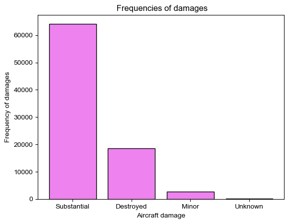
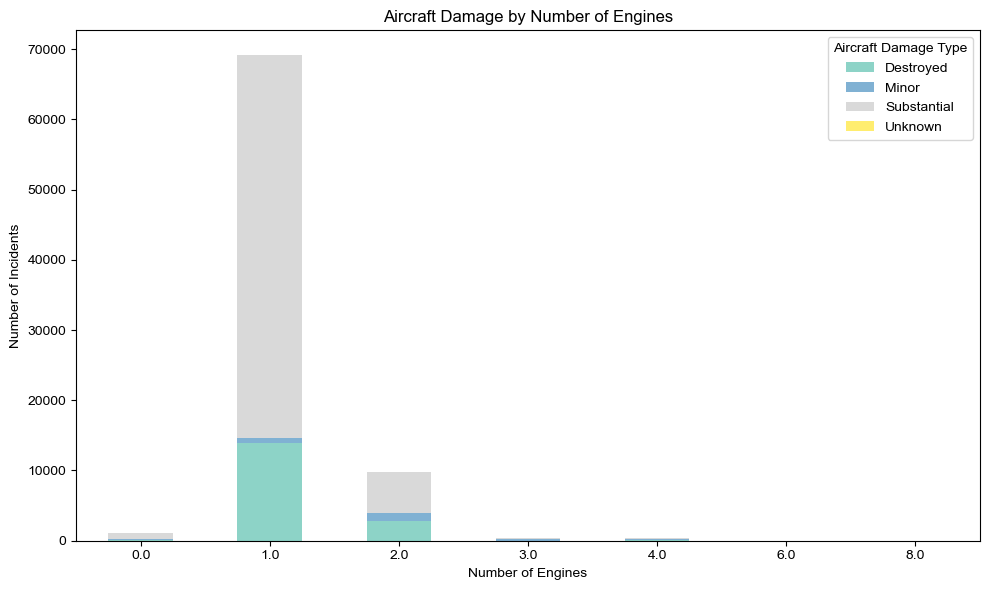
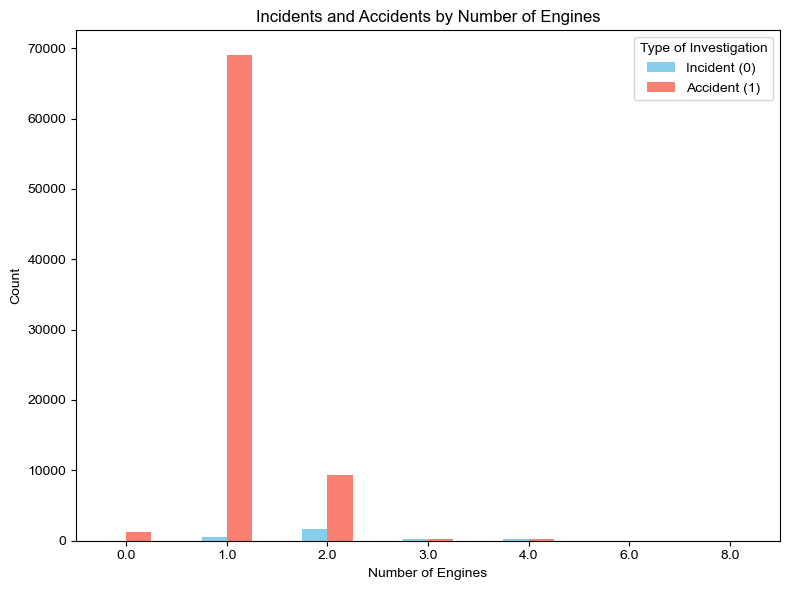
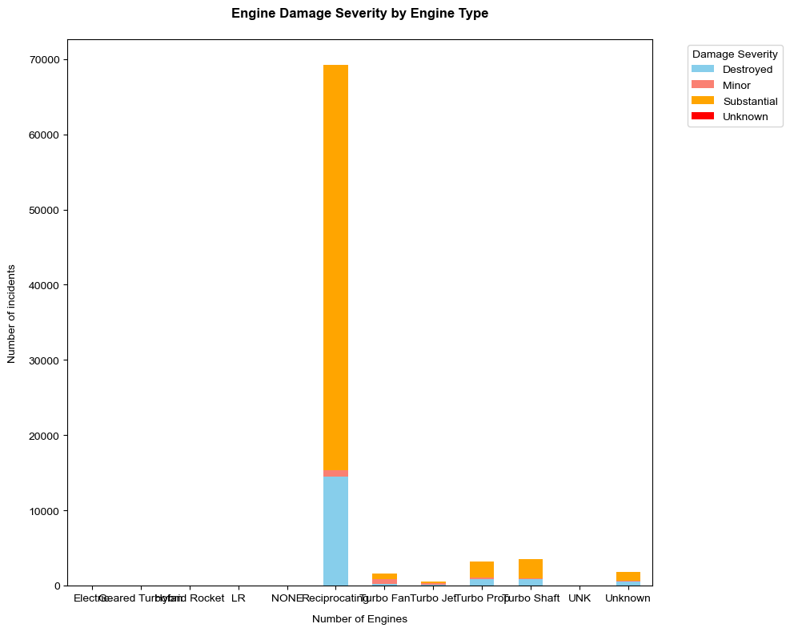
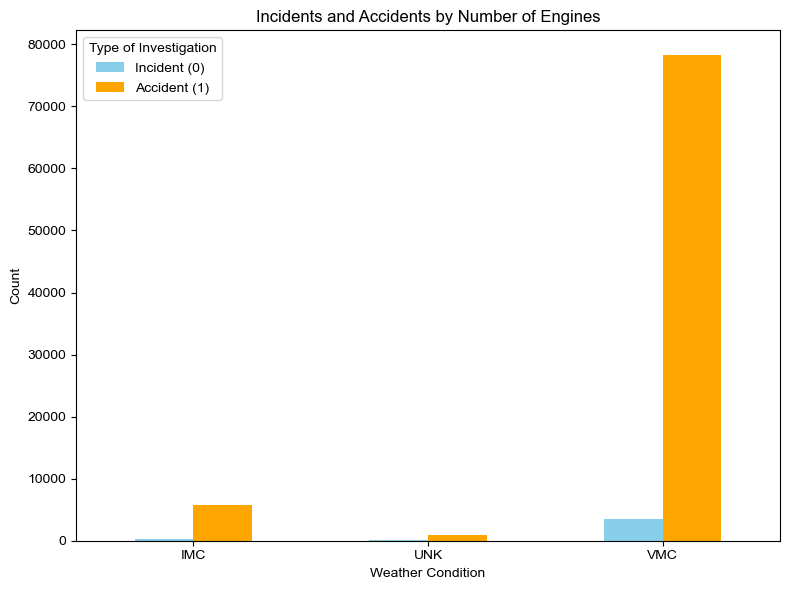
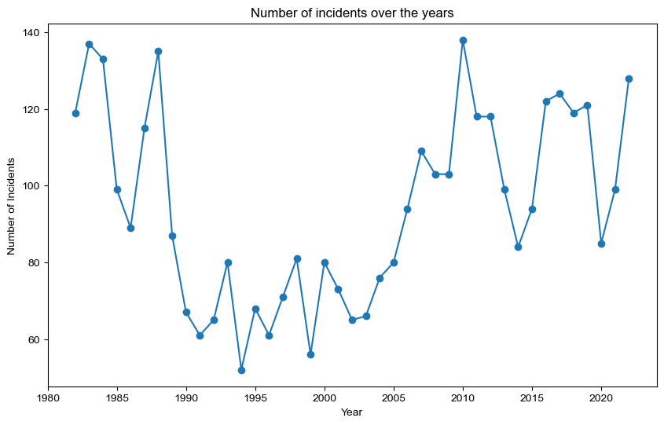
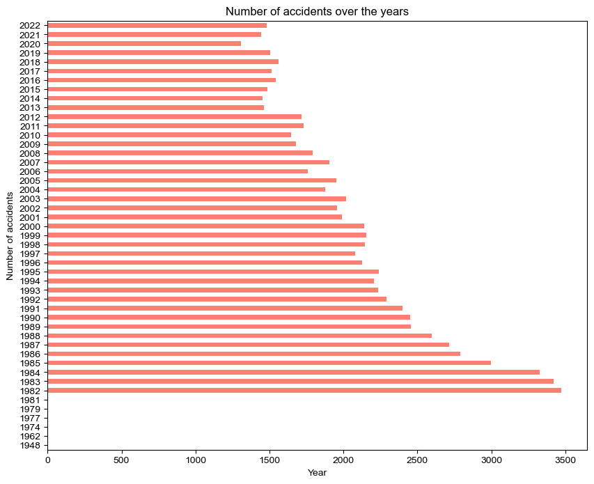

#  Cleared for Takeoff: A Data-Driven Risk Analysis for Strategic Aircraft Acquisition


## Overview
This project aims at analyzing data from the National Transportation Safety Board [Aviation accident database](https://www.kaggle.com/datasets/khsamaha/aviation-accident-database-synopses), which contains aviation accident records from 1962 to 2023, within the United States, its territories and possessions, and in international waters. The primary objective is to assess the safety of various aircraft to ensure our clients make well-informed and risk-conscious purchasing decisions as they expand into the aviation sector.


## Business Understanding
Our client is seeking to broaden their investment portfolio by entering new markets. They are particularly interested in acquiring and managing aircraft for both commercial and private use. As a data analyst, my objective is to identify the safest and most reliable aircraft options to support the company's entry into this aviation venture.


## Data Understanding
The dataset used in this analysis is sourced from Kaggle: [Aviation Accident Database & Synopses (up to 2023)](https://www.kaggle.com/datasets/khsamaha/aviation-accident-database-synopses). It contains detailed records of aviation accidents investigated by the U.S. National Transportation Safety Board (NTSB) from 1962 to 2023. This information allows for a comprehensive analysis of accident patterns, helping us determine which aircraft types have the lowest risk profiles. Specifically, we will assess factors such as the number of engines, aircraft condition prior to takeoff, and geographical locations with higher accident frequencies. The goal is to identify trends and safety indicators that can guide the company in selecting safer aircraft for commercial and private operations.


```python
# import pandas to load the data and create dataframes, we use pandas methods to inspect the shape and other attributes of these data frames
import pandas as pd
```


```python
#used encoding latin1 because maybe our data contains special characters that cannot be read with 'utf-8'
#load the csv file using alias pd
aircraft_data = pd.read_csv('AviationData.csv', encoding = 'latin1', low_memory=False)# tells pandas to read the whole file first then determine the best datatype for each column
aircraft_data.head()
```


<div>
<style scoped>
    .dataframe tbody tr th:only-of-type {
        vertical-align: middle;
    }

    .dataframe tbody tr th {
        vertical-align: top;
    }

    .dataframe thead th {
        text-align: right;
    }
</style>
<table border="1" class="dataframe">
  <thead>
    <tr style="text-align: right;">
      <th></th>
      <th>Event.Id</th>
      <th>Investigation.Type</th>
      <th>Accident.Number</th>
      <th>Event.Date</th>
      <th>Location</th>
      <th>Country</th>
      <th>Latitude</th>
      <th>Longitude</th>
      <th>Airport.Code</th>
      <th>Airport.Name</th>
      <th>...</th>
      <th>Purpose.of.flight</th>
      <th>Air.carrier</th>
      <th>Total.Fatal.Injuries</th>
      <th>Total.Serious.Injuries</th>
      <th>Total.Minor.Injuries</th>
      <th>Total.Uninjured</th>
      <th>Weather.Condition</th>
      <th>Broad.phase.of.flight</th>
      <th>Report.Status</th>
      <th>Publication.Date</th>
    </tr>
  </thead>
  <tbody>
    <tr>
      <th>0</th>
      <td>20001218X45444</td>
      <td>Accident</td>
      <td>SEA87LA080</td>
      <td>1948-10-24</td>
      <td>MOOSE CREEK, ID</td>
      <td>United States</td>
      <td>NaN</td>
      <td>NaN</td>
      <td>NaN</td>
      <td>NaN</td>
      <td>...</td>
      <td>Personal</td>
      <td>NaN</td>
      <td>2.0</td>
      <td>0.0</td>
      <td>0.0</td>
      <td>0.0</td>
      <td>UNK</td>
      <td>Cruise</td>
      <td>Probable Cause</td>
      <td>NaN</td>
    </tr>
    <tr>
      <th>1</th>
      <td>20001218X45447</td>
      <td>Accident</td>
      <td>LAX94LA336</td>
      <td>1962-07-19</td>
      <td>BRIDGEPORT, CA</td>
      <td>United States</td>
      <td>NaN</td>
      <td>NaN</td>
      <td>NaN</td>
      <td>NaN</td>
      <td>...</td>
      <td>Personal</td>
      <td>NaN</td>
      <td>4.0</td>
      <td>0.0</td>
      <td>0.0</td>
      <td>0.0</td>
      <td>UNK</td>
      <td>Unknown</td>
      <td>Probable Cause</td>
      <td>19-09-1996</td>
    </tr>
    <tr>
      <th>2</th>
      <td>20061025X01555</td>
      <td>Accident</td>
      <td>NYC07LA005</td>
      <td>1974-08-30</td>
      <td>Saltville, VA</td>
      <td>United States</td>
      <td>36.922223</td>
      <td>-81.878056</td>
      <td>NaN</td>
      <td>NaN</td>
      <td>...</td>
      <td>Personal</td>
      <td>NaN</td>
      <td>3.0</td>
      <td>NaN</td>
      <td>NaN</td>
      <td>NaN</td>
      <td>IMC</td>
      <td>Cruise</td>
      <td>Probable Cause</td>
      <td>26-02-2007</td>
    </tr>
    <tr>
      <th>3</th>
      <td>20001218X45448</td>
      <td>Accident</td>
      <td>LAX96LA321</td>
      <td>1977-06-19</td>
      <td>EUREKA, CA</td>
      <td>United States</td>
      <td>NaN</td>
      <td>NaN</td>
      <td>NaN</td>
      <td>NaN</td>
      <td>...</td>
      <td>Personal</td>
      <td>NaN</td>
      <td>2.0</td>
      <td>0.0</td>
      <td>0.0</td>
      <td>0.0</td>
      <td>IMC</td>
      <td>Cruise</td>
      <td>Probable Cause</td>
      <td>12-09-2000</td>
    </tr>
    <tr>
      <th>4</th>
      <td>20041105X01764</td>
      <td>Accident</td>
      <td>CHI79FA064</td>
      <td>1979-08-02</td>
      <td>Canton, OH</td>
      <td>United States</td>
      <td>NaN</td>
      <td>NaN</td>
      <td>NaN</td>
      <td>NaN</td>
      <td>...</td>
      <td>Personal</td>
      <td>NaN</td>
      <td>1.0</td>
      <td>2.0</td>
      <td>NaN</td>
      <td>0.0</td>
      <td>VMC</td>
      <td>Approach</td>
      <td>Probable Cause</td>
      <td>16-04-1980</td>
    </tr>
  </tbody>
</table>
<p>5 rows × 31 columns</p>
</div>


```python
#Check the data types for each columns
aircraft_data.info()
```

    <class 'pandas.core.frame.DataFrame'>
    RangeIndex: 88889 entries, 0 to 88888
    Data columns (total 31 columns):
     #   Column                  Non-Null Count  Dtype  
    ---  ------                  --------------  -----  
     0   Event.Id                88889 non-null  object 
     1   Investigation.Type      88889 non-null  object 
     2   Accident.Number         88889 non-null  object 
     3   Event.Date              88889 non-null  object 
     4   Location                88837 non-null  object 
     5   Country                 88663 non-null  object 
     6   Latitude                34382 non-null  object 
     7   Longitude               34373 non-null  object 
     8   Airport.Code            50132 non-null  object 
     9   Airport.Name            52704 non-null  object 
     10  Injury.Severity         87889 non-null  object 
     11  Aircraft.damage         85695 non-null  object 
     12  Aircraft.Category       32287 non-null  object 
     13  Registration.Number     87507 non-null  object 
     14  Make                    88826 non-null  object 
     15  Model                   88797 non-null  object 
     16  Amateur.Built           88787 non-null  object 
     17  Number.of.Engines       82805 non-null  float64
     18  Engine.Type             81793 non-null  object 
     19  FAR.Description         32023 non-null  object 
     20  Schedule                12582 non-null  object 
     21  Purpose.of.flight       82697 non-null  object 
     22  Air.carrier             16648 non-null  object 
     23  Total.Fatal.Injuries    77488 non-null  float64
     24  Total.Serious.Injuries  76379 non-null  float64
     25  Total.Minor.Injuries    76956 non-null  float64
     26  Total.Uninjured         82977 non-null  float64
     27  Weather.Condition       84397 non-null  object 
     28  Broad.phase.of.flight   61724 non-null  object 
     29  Report.Status           82505 non-null  object 
     30  Publication.Date        75118 non-null  object 
    dtypes: float64(5), object(26)
    memory usage: 21.0+ MB
    

# Info analysis
From the information above, the dataset contains a total of 88,889 entries and 31 columns. By reviewing an overview of the data, we can identify which columns contain null values and make informed decisions on which ones to retain or drop.
Now check the relevance of each column to our goal.


```python
# checking for the percentage of null values in each column
aircraft_data.isna().mean()*100
```


    Event.Id                   0.000000
    Investigation.Type         0.000000
    Accident.Number            0.000000
    Event.Date                 0.000000
    Location                   0.058500
    Country                    0.254250
    Latitude                  61.320298
    Longitude                 61.330423
    Airport.Code              43.601570
    Airport.Name              40.708074
    Injury.Severity            1.124999
    Aircraft.damage            3.593246
    Aircraft.Category         63.677170
    Registration.Number        1.554748
    Make                       0.070875
    Model                      0.103500
    Amateur.Built              0.114750
    Number.of.Engines          6.844491
    Engine.Type                7.982990
    FAR.Description           63.974170
    Schedule                  85.845268
    Purpose.of.flight          6.965991
    Air.carrier               81.271023
    Total.Fatal.Injuries      12.826109
    Total.Serious.Injuries    14.073732
    Total.Minor.Injuries      13.424608
    Total.Uninjured            6.650992
    Weather.Condition          5.053494
    Broad.phase.of.flight     30.560587
    Report.Status              7.181991
    Publication.Date          15.492356
    dtype: float64


# Dropping Columns

Columns such as `Air.carrier` have approximately 81% missing values, and `Schedule` has around 85% missing values. Let’s now evaluate their relevance to determine whether they should be retained or dropped from the dataset.


```python
#drop the Air.Carrier and schedule column due to its higher percentage of missing values
aircraft_data.drop(['Air.carrier','Schedule'], axis= 1, inplace=True)
```


```python
aircraft_data.info()
```

    <class 'pandas.core.frame.DataFrame'>
    RangeIndex: 88889 entries, 0 to 88888
    Data columns (total 29 columns):
     #   Column                  Non-Null Count  Dtype  
    ---  ------                  --------------  -----  
     0   Event.Id                88889 non-null  object 
     1   Investigation.Type      88889 non-null  object 
     2   Accident.Number         88889 non-null  object 
     3   Event.Date              88889 non-null  object 
     4   Location                88837 non-null  object 
     5   Country                 88663 non-null  object 
     6   Latitude                34382 non-null  object 
     7   Longitude               34373 non-null  object 
     8   Airport.Code            50132 non-null  object 
     9   Airport.Name            52704 non-null  object 
     10  Injury.Severity         87889 non-null  object 
     11  Aircraft.damage         85695 non-null  object 
     12  Aircraft.Category       32287 non-null  object 
     13  Registration.Number     87507 non-null  object 
     14  Make                    88826 non-null  object 
     15  Model                   88797 non-null  object 
     16  Amateur.Built           88787 non-null  object 
     17  Number.of.Engines       82805 non-null  float64
     18  Engine.Type             81793 non-null  object 
     19  FAR.Description         32023 non-null  object 
     20  Purpose.of.flight       82697 non-null  object 
     21  Total.Fatal.Injuries    77488 non-null  float64
     22  Total.Serious.Injuries  76379 non-null  float64
     23  Total.Minor.Injuries    76956 non-null  float64
     24  Total.Uninjured         82977 non-null  float64
     25  Weather.Condition       84397 non-null  object 
     26  Broad.phase.of.flight   61724 non-null  object 
     27  Report.Status           82505 non-null  object 
     28  Publication.Date        75118 non-null  object 
    dtypes: float64(5), object(24)
    memory usage: 19.7+ MB
    

# Making Sure columns We are interested in are Uniform and dealing with null values


## `Weather` Column


```python
aircraft_data['Weather.Condition'].value_counts()
```


    Weather.Condition
    VMC    77303
    IMC     5976
    UNK      856
    Unk      262
    Name: count, dtype: int64


From the above output `UNK` and `unk`are the same just diffrent capitalization. we make the uniform by `.str.upper()`method


```python
aircraft_data['Weather.Condition']=aircraft_data['Weather.Condition'].str.upper()
```

Filled the nan values with VMC since its the most frequent


```python
# filling the nan values with most frequent
aircraft_data['Weather.Condition']=aircraft_data['Weather.Condition'].fillna('VMC')
```

## `Make` Column


```python
#code to look at the unique types of Makes
aircraft_data['Make'].value_counts()
```


    Make
    Cessna             22227
    Piper              12029
    CESSNA              4922
    Beech               4330
    PIPER               2841
                       ...  
    Leonard Walters        1
    Maule Air Inc.         1
    Motley Vans            1
    Perlick                1
    ROYSE RALPH L          1
    Name: count, Length: 8237, dtype: int64


From the output above, `Cessna` and `CESSNA` refer to the same make, but with different capitalizations. We will standardize the `Make` column by applying the `.title()` method


```python
# making the names in Make be uniform 
aircraft_data['Make']=aircraft_data['Make'].str.title()

```

## `Model` Column


```python
aircraft_data['Model'].value_counts()
```


    Model
    152              2367
    172              1756
    172N             1164
    PA-28-140         932
    150               829
                     ... 
    GC-1-A              1
    737-3S3             1
    MBB-BK117-B2        1
    GLASSAIR GL25       1
    M-8 EAGLE           1
    Name: count, Length: 12318, dtype: int64


```python
aircraft_data['Model']=aircraft_data['Model'].str.upper()
```


```python
aircraft_data['Model'].value_counts()
```


    Model
    152                 2367
    172                 1756
    172N                1164
    PA-28-140            932
    150                  829
                        ... 
    E75NL                  1
    747-273C               1
    WATCHA-MCCALL-IT       1
    MD-520N                1
    M-8 EAGLE              1
    Name: count, Length: 11646, dtype: int64


```python
# concatenating Make and Mode
aircraft_data['Aircraft_type']=aircraft_data['Make']+" "+ aircraft_data['Model']
```

## `Purpose of flight` Column


```python
aircraft_data['Purpose.of.flight'].value_counts()
```


    Purpose.of.flight
    Personal                     49448
    Instructional                10601
    Unknown                       6802
    Aerial Application            4712
    Business                      4018
    Positioning                   1646
    Other Work Use                1264
    Ferry                          812
    Aerial Observation             794
    Public Aircraft                720
    Executive/corporate            553
    Flight Test                    405
    Skydiving                      182
    External Load                  123
    Public Aircraft - Federal      105
    Banner Tow                     101
    Air Race show                   99
    Public Aircraft - Local         74
    Public Aircraft - State         64
    Air Race/show                   59
    Glider Tow                      53
    Firefighting                    40
    Air Drop                        11
    ASHO                             6
    PUBS                             4
    PUBL                             1
    Name: count, dtype: int64


```python
aircraft_data['Purpose.of.flight'] =aircraft_data['Purpose.of.flight'].fillna('Personal')

```

Missing values in the `Purpose.of.flight` columns were filled with `Personal` since it was the most frequent category, representing the majority of the data 

## `Engine Type` Column


```python
aircraft_data['Engine.Type'].value_counts()
```


    Engine.Type
    Reciprocating      69530
    Turbo Shaft         3609
    Turbo Prop          3391
    Turbo Fan           2481
    Unknown             2051
    Turbo Jet            703
    Geared Turbofan       12
    Electric              10
    LR                     2
    NONE                   2
    Hybrid Rocket          1
    UNK                    1
    Name: count, dtype: int64


# Checking for Correlation betweeen Numeric Data
I was interested in checking whether `Amateur Built` is correlated with the `Type.Of.investigation`. To do this, I'll need to convert the columns to numeric format.


```python
#Change the amateur built into a numbers 
aircraft_data['Amateur.Built']=aircraft_data['Amateur.Built'].map({'Yes': 1, 'No':0})
```


```python
#Change the Investigation types to numbers 
aircraft_data['Investigation.Type']=aircraft_data['Investigation.Type'].map({'Accident': 1, 'Incident':0})
```


```python
#Checking correlation between numeric data
aircraft_data.corr(numeric_only=True)
```


<div>
<style scoped>
    .dataframe tbody tr th:only-of-type {
        vertical-align: middle;
    }

    .dataframe tbody tr th {
        vertical-align: top;
    }

    .dataframe thead th {
        text-align: right;
    }
</style>
<table border="1" class="dataframe">
  <thead>
    <tr style="text-align: right;">
      <th></th>
      <th>Investigation.Type</th>
      <th>Amateur.Built</th>
      <th>Number.of.Engines</th>
      <th>Total.Fatal.Injuries</th>
      <th>Total.Serious.Injuries</th>
      <th>Total.Minor.Injuries</th>
      <th>Total.Uninjured</th>
    </tr>
  </thead>
  <tbody>
    <tr>
      <th>Investigation.Type</th>
      <td>1.000000</td>
      <td>0.061804</td>
      <td>-0.370518</td>
      <td>0.024367</td>
      <td>0.025172</td>
      <td>-0.000623</td>
      <td>-0.348089</td>
    </tr>
    <tr>
      <th>Amateur.Built</th>
      <td>0.061804</td>
      <td>1.000000</td>
      <td>-0.106847</td>
      <td>-0.012407</td>
      <td>-0.001795</td>
      <td>-0.003396</td>
      <td>-0.049998</td>
    </tr>
    <tr>
      <th>Number.of.Engines</th>
      <td>-0.370518</td>
      <td>-0.106847</td>
      <td>1.000000</td>
      <td>0.098505</td>
      <td>0.046157</td>
      <td>0.098162</td>
      <td>0.406058</td>
    </tr>
    <tr>
      <th>Total.Fatal.Injuries</th>
      <td>0.024367</td>
      <td>-0.012407</td>
      <td>0.098505</td>
      <td>1.000000</td>
      <td>0.135724</td>
      <td>0.073559</td>
      <td>-0.015214</td>
    </tr>
    <tr>
      <th>Total.Serious.Injuries</th>
      <td>0.025172</td>
      <td>-0.001795</td>
      <td>0.046157</td>
      <td>0.135724</td>
      <td>1.000000</td>
      <td>0.326849</td>
      <td>0.052869</td>
    </tr>
    <tr>
      <th>Total.Minor.Injuries</th>
      <td>-0.000623</td>
      <td>-0.003396</td>
      <td>0.098162</td>
      <td>0.073559</td>
      <td>0.326849</td>
      <td>1.000000</td>
      <td>0.147770</td>
    </tr>
    <tr>
      <th>Total.Uninjured</th>
      <td>-0.348089</td>
      <td>-0.049998</td>
      <td>0.406058</td>
      <td>-0.015214</td>
      <td>0.052869</td>
      <td>0.147770</td>
      <td>1.000000</td>
    </tr>
  </tbody>
</table>
</div>


Cheking the correlation between numeric data there are negative correlations and weak corelation

# Cheking the Frequencies of Damages


```python
#checking type of damages 
damage_counts=aircraft_data['Aircraft.damage'].value_counts()
```


```python
#create a the intensity of a damage and the find its mean to see where they lie
aircraft_data['Severity.Score'] = aircraft_data['Aircraft.damage'].map({'Minor': 1, 'Substantial': 2, 'Destroyed': 3})
```


```python
# import matplotlib to draw graph and shows a plot inside Jupyter notebook
import matplotlib.pyplot as plt
%matplotlib inline
```


```python
plt.bar(damage_counts.index, damage_counts.values,edgecolor='black', color= 'violet')
plt.xlabel('Aircraft damage')
plt.ylabel('Frequency of damages')
plt.title(' Frequencies of damages')
plt.show()
```


    

    


```python
aircraft_data['Aircraft_type'].value_counts()

```


    Aircraft_type
    Cessna 152                  2366
    Cessna 172                  1753
    Cessna 172N                 1163
    Piper PA-28-140              932
    Cessna 150                   829
                                ... 
    Sherman Powell KITFOX IV       1
    Maule M5C                      1
    Smith SONERAI-I                1
    Shafer SONERAI-I               1
    Royse Ralph L GLASAIR          1
    Name: count, Length: 18245, dtype: int64


```python
safety_df= aircraft_data.pivot_table(index='Aircraft_type', columns= 'Aircraft.damage' ,values ='Event.Id',aggfunc='count',fill_value=0)
```


```python
minor_damages_safe=safety_df[(safety_df['Destroyed']==0) & (safety_df['Minor']==1) & (safety_df['Substantial']==0)]
minor_damages_safe
```


<div>
<style scoped>
    .dataframe tbody tr th:only-of-type {
        vertical-align: middle;
    }

    .dataframe tbody tr th {
        vertical-align: top;
    }

    .dataframe thead th {
        text-align: right;
    }
</style>
<table border="1" class="dataframe">
  <thead>
    <tr style="text-align: right;">
      <th>Aircraft.damage</th>
      <th>Destroyed</th>
      <th>Minor</th>
      <th>Substantial</th>
      <th>Unknown</th>
    </tr>
    <tr>
      <th>Aircraft_type</th>
      <th></th>
      <th></th>
      <th></th>
      <th></th>
    </tr>
  </thead>
  <tbody>
    <tr>
      <th>2007 Savage Air Llc EPIC LT</th>
      <td>0</td>
      <td>1</td>
      <td>0</td>
      <td>0</td>
    </tr>
    <tr>
      <th>Abruzzo GROM-1</th>
      <td>0</td>
      <td>1</td>
      <td>0</td>
      <td>0</td>
    </tr>
    <tr>
      <th>Aero Commander 681B</th>
      <td>0</td>
      <td>1</td>
      <td>0</td>
      <td>0</td>
    </tr>
    <tr>
      <th>Aerospatiale A-300B4</th>
      <td>0</td>
      <td>1</td>
      <td>0</td>
      <td>0</td>
    </tr>
    <tr>
      <th>Aerospatiale ATR-42</th>
      <td>0</td>
      <td>1</td>
      <td>0</td>
      <td>0</td>
    </tr>
    <tr>
      <th>...</th>
      <td>...</td>
      <td>...</td>
      <td>...</td>
      <td>...</td>
    </tr>
    <tr>
      <th>Unknown GLIDER TRYKE</th>
      <td>0</td>
      <td>1</td>
      <td>0</td>
      <td>0</td>
    </tr>
    <tr>
      <th>Us/Lta 138-S</th>
      <td>0</td>
      <td>1</td>
      <td>0</td>
      <td>0</td>
    </tr>
    <tr>
      <th>Wayne Hooks CASSUTT III-M</th>
      <td>0</td>
      <td>1</td>
      <td>0</td>
      <td>0</td>
    </tr>
    <tr>
      <th>Wizard W-1</th>
      <td>0</td>
      <td>1</td>
      <td>0</td>
      <td>0</td>
    </tr>
    <tr>
      <th>Young Robert Herman WOODY PUSHER</th>
      <td>0</td>
      <td>1</td>
      <td>0</td>
      <td>0</td>
    </tr>
  </tbody>
</table>
<p>566 rows × 4 columns</p>
</div>


```python
aircrafts_safe_list= list(minor_damages_safe.index)
```

# Number of engines


```python
#grouping the number of engines to the aircraft damage
safe_numberof_engines=aircraft_data.pivot_table(index='Number.of.Engines', columns= 'Aircraft.damage' ,values ='Event.Id',aggfunc='count',fill_value=0)
safe_numberof_engines
```


<div>
<style scoped>
    .dataframe tbody tr th:only-of-type {
        vertical-align: middle;
    }

    .dataframe tbody tr th {
        vertical-align: top;
    }

    .dataframe thead th {
        text-align: right;
    }
</style>
<table border="1" class="dataframe">
  <thead>
    <tr style="text-align: right;">
      <th>Aircraft.damage</th>
      <th>Destroyed</th>
      <th>Minor</th>
      <th>Substantial</th>
      <th>Unknown</th>
    </tr>
    <tr>
      <th>Number.of.Engines</th>
      <th></th>
      <th></th>
      <th></th>
      <th></th>
    </tr>
  </thead>
  <tbody>
    <tr>
      <th>0.0</th>
      <td>173</td>
      <td>74</td>
      <td>842</td>
      <td>2</td>
    </tr>
    <tr>
      <th>1.0</th>
      <td>13862</td>
      <td>726</td>
      <td>54565</td>
      <td>50</td>
    </tr>
    <tr>
      <th>2.0</th>
      <td>2871</td>
      <td>1095</td>
      <td>5868</td>
      <td>9</td>
    </tr>
    <tr>
      <th>3.0</th>
      <td>25</td>
      <td>197</td>
      <td>104</td>
      <td>0</td>
    </tr>
    <tr>
      <th>4.0</th>
      <td>58</td>
      <td>145</td>
      <td>114</td>
      <td>0</td>
    </tr>
    <tr>
      <th>6.0</th>
      <td>0</td>
      <td>0</td>
      <td>1</td>
      <td>0</td>
    </tr>
    <tr>
      <th>8.0</th>
      <td>0</td>
      <td>0</td>
      <td>2</td>
      <td>0</td>
    </tr>
  </tbody>
</table>
</div>


```python
engine_number_score=aircraft_data.groupby('Number.of.Engines')['Severity.Score'].mean().sort_values()
engine_number_score
```


    Number.of.Engines
    3.0    1.472393
    4.0    1.725552
    6.0    2.000000
    8.0    2.000000
    0.0    2.090909
    2.0    2.180598
    1.0    2.189956
    Name: Severity.Score, dtype: float64


```python
safe_engine_numbers= list(engine_number_score[engine_number_score < 2].index)
safe_engine_numbers
```


    [3.0, 4.0]


Its safe to assume that 3 and 4 engines are the most safer due to the minor severity score


```python
# plotting a graph to indicate number of engines by aircraft dama
fig,ax= plt.subplots(figsize=(10,6))

# plotting a stacked bar graph
safe_numberof_engines.plot(kind='bar', stacked=True, ax=ax, colormap='Set3')

# customize the chart
ax.set_title('Aircraft Damage by Number of Engines')
ax.set_xlabel('Number of Engines')
ax.set_ylabel('Number of Incidents')
ax.legend(title='Aircraft Damage Type')
plt.xticks(rotation=0)
plt.tight_layout()

plt.show()
```


    

    


# Incidents and Accidents by Number of Engines


```python
#Group and count combinations of Engine count vs Type of investigation
engine_investigation_counts = aircraft_data.groupby(['Number.of.Engines', 'Investigation.Type']).size().unstack(fill_value=0)

# Rename the columns for clarity
engine_investigation_counts.columns = ['Incident (0)', 'Accident (1)']

# Plot using fig and ax
fig, ax = plt.subplots(figsize=(8, 6))
engine_investigation_counts.plot(kind='bar', ax=ax, color=['skyblue', 'salmon'])

#Customize the plot
ax.set_title('Incidents and Accidents by Number of Engines')
ax.set_xlabel('Number of Engines')
ax.set_ylabel('Count')
ax.legend(title='Type of Investigation')
ax.set_xticklabels(engine_investigation_counts.index.astype(str),rotation=0)

#Show the plot
plt.tight_layout()
plt.show()


```


    

    


Observation: aircrafts with one engine has the most accidents 

# Type of engines by damages


```python
safe_type_of_engines=aircraft_data.pivot_table(index='Engine.Type', columns= 'Aircraft.damage' ,values ='Event.Id',aggfunc='count',fill_value=0)
safe_type_of_engines
```


<div>
<style scoped>
    .dataframe tbody tr th:only-of-type {
        vertical-align: middle;
    }

    .dataframe tbody tr th {
        vertical-align: top;
    }

    .dataframe thead th {
        text-align: right;
    }
</style>
<table border="1" class="dataframe">
  <thead>
    <tr style="text-align: right;">
      <th>Aircraft.damage</th>
      <th>Destroyed</th>
      <th>Minor</th>
      <th>Substantial</th>
      <th>Unknown</th>
    </tr>
    <tr>
      <th>Engine.Type</th>
      <th></th>
      <th></th>
      <th></th>
      <th></th>
    </tr>
  </thead>
  <tbody>
    <tr>
      <th>Electric</th>
      <td>2</td>
      <td>0</td>
      <td>8</td>
      <td>0</td>
    </tr>
    <tr>
      <th>Geared Turbofan</th>
      <td>0</td>
      <td>1</td>
      <td>0</td>
      <td>0</td>
    </tr>
    <tr>
      <th>Hybrid Rocket</th>
      <td>1</td>
      <td>0</td>
      <td>0</td>
      <td>0</td>
    </tr>
    <tr>
      <th>LR</th>
      <td>0</td>
      <td>0</td>
      <td>1</td>
      <td>0</td>
    </tr>
    <tr>
      <th>NONE</th>
      <td>0</td>
      <td>0</td>
      <td>2</td>
      <td>0</td>
    </tr>
    <tr>
      <th>Reciprocating</th>
      <td>14529</td>
      <td>853</td>
      <td>53805</td>
      <td>6</td>
    </tr>
    <tr>
      <th>Turbo Fan</th>
      <td>196</td>
      <td>670</td>
      <td>730</td>
      <td>0</td>
    </tr>
    <tr>
      <th>Turbo Jet</th>
      <td>140</td>
      <td>162</td>
      <td>234</td>
      <td>0</td>
    </tr>
    <tr>
      <th>Turbo Prop</th>
      <td>807</td>
      <td>306</td>
      <td>2035</td>
      <td>0</td>
    </tr>
    <tr>
      <th>Turbo Shaft</th>
      <td>879</td>
      <td>91</td>
      <td>2549</td>
      <td>0</td>
    </tr>
    <tr>
      <th>UNK</th>
      <td>0</td>
      <td>0</td>
      <td>1</td>
      <td>0</td>
    </tr>
    <tr>
      <th>Unknown</th>
      <td>544</td>
      <td>132</td>
      <td>1133</td>
      <td>0</td>
    </tr>
  </tbody>
</table>
</div>


```python
 engine_score=aircraft_data.groupby('Engine.Type')['Severity.Score'].mean().sort_values()
```


```python
#Group and count combinations of Engine count vs Type of investigation
engine_damage_counts = aircraft_data.groupby(['Engine.Type', 'Aircraft.damage']).size().unstack(fill_value=0)

# Rename the columns for clarity
engine_type_damage_counts.columns = ['Minor','Substantial', 'Destroyed', 'Unknown']

# Plot using fig and ax
fig, ax = plt.subplots(figsize=(10, 8))
engine_damage_counts.plot(kind='bar', ax=ax,stacked= True, color=['skyblue', 'salmon','orange','red'])

#Customize the plot
ax.set_title('Engine Damage Severity by Engine Type', pad=20, fontweight='bold')
ax.set_xlabel('Number of Engines', labelpad=10)
ax.set_ylabel('Number of incidents',labelpad=10)
ax.legend(title='Damage Severity' ,bbox_to_anchor=(1.05,1), loc= 2)
ax.set_xticklabels(engine_type_damage_counts.index.astype(str),rotation=0)


plt.tight_layout()
plt.show()

```


    

    


```python
# create a list of engine type with less than 2 score
safe_engine_type = list(engine_score[engine_score < 2].index)
safe_engine_type
```


    ['Geared Turbofan', 'Turbo Fan', 'Turbo Jet']


## Weather Condition with Higher number of damages 


```python
aircraft_data['Weather.Condition'].value_counts()
```


    Weather.Condition
    VMC    81795
    IMC     5976
    UNK     1118
    Name: count, dtype: int64


A number of incidents occurred under favorable weather conditions `VMC`. This suggests that weather may not have been the primary contributing factor in these cases. Further analysis is needed to explore other contributing factors such as pilot experience, mechanical failure, or maintenance history."


```python
# graph showing how weather condition infuenced incidents and accidents
engine_investigation_counts = aircraft_data.groupby(['Weather.Condition', 'Investigation.Type']).size().unstack(fill_value=0)

# Rename the columns for clarity
engine_investigation_counts.columns = ['Incident (0)', 'Accident (1)']

# Plot using fig and ax
fig, ax = plt.subplots(figsize=(8, 6))
engine_investigation_counts.plot(kind='bar', ax=ax, color=['skyblue', 'orange'])

#Customize the plot
ax.set_title('Incidents and Accidents by Number of Engines')
ax.set_xlabel('Weather Condition')
ax.set_ylabel('Count')
ax.legend(title='Type of Investigation', loc= 2)
ax.set_xticklabels(engine_investigation_counts.index.astype(str),rotation=0)

#Show the plot
plt.tight_layout()
plt.show()


```


    

    


## Grouping the purpose of flight to Aircraft.damage


```python
purpose_safety=aircraft_data.pivot_table(index='Purpose.of.flight', columns= 'Aircraft.damage' ,values ='Event.Id',aggfunc='count',fill_value=0)
purpose_safety.sort_values(by='Substantial', ascending = False)
```


<div>
<style scoped>
    .dataframe tbody tr th:only-of-type {
        vertical-align: middle;
    }

    .dataframe tbody tr th {
        vertical-align: top;
    }

    .dataframe thead th {
        text-align: right;
    }
</style>
<table border="1" class="dataframe">
  <thead>
    <tr style="text-align: right;">
      <th>Aircraft.damage</th>
      <th>Destroyed</th>
      <th>Minor</th>
      <th>Substantial</th>
      <th>Unknown</th>
    </tr>
    <tr>
      <th>Purpose.of.flight</th>
      <th></th>
      <th></th>
      <th></th>
      <th></th>
    </tr>
  </thead>
  <tbody>
    <tr>
      <th>Personal</th>
      <td>11678</td>
      <td>1380</td>
      <td>40505</td>
      <td>99</td>
    </tr>
    <tr>
      <th>Instructional</th>
      <td>1212</td>
      <td>159</td>
      <td>9146</td>
      <td>10</td>
    </tr>
    <tr>
      <th>Aerial Application</th>
      <td>1069</td>
      <td>28</td>
      <td>3600</td>
      <td>1</td>
    </tr>
    <tr>
      <th>Unknown</th>
      <td>1745</td>
      <td>895</td>
      <td>3337</td>
      <td>1</td>
    </tr>
    <tr>
      <th>Business</th>
      <td>1186</td>
      <td>107</td>
      <td>2630</td>
      <td>3</td>
    </tr>
    <tr>
      <th>Positioning</th>
      <td>412</td>
      <td>72</td>
      <td>1119</td>
      <td>0</td>
    </tr>
    <tr>
      <th>Other Work Use</th>
      <td>266</td>
      <td>44</td>
      <td>896</td>
      <td>1</td>
    </tr>
    <tr>
      <th>Ferry</th>
      <td>235</td>
      <td>27</td>
      <td>543</td>
      <td>0</td>
    </tr>
    <tr>
      <th>Aerial Observation</th>
      <td>225</td>
      <td>12</td>
      <td>536</td>
      <td>1</td>
    </tr>
    <tr>
      <th>Public Aircraft</th>
      <td>209</td>
      <td>20</td>
      <td>478</td>
      <td>0</td>
    </tr>
    <tr>
      <th>Executive/corporate</th>
      <td>159</td>
      <td>33</td>
      <td>331</td>
      <td>2</td>
    </tr>
    <tr>
      <th>Flight Test</th>
      <td>68</td>
      <td>7</td>
      <td>322</td>
      <td>0</td>
    </tr>
    <tr>
      <th>Skydiving</th>
      <td>38</td>
      <td>9</td>
      <td>131</td>
      <td>0</td>
    </tr>
    <tr>
      <th>External Load</th>
      <td>16</td>
      <td>0</td>
      <td>99</td>
      <td>0</td>
    </tr>
    <tr>
      <th>Banner Tow</th>
      <td>9</td>
      <td>0</td>
      <td>92</td>
      <td>0</td>
    </tr>
    <tr>
      <th>Public Aircraft - Federal</th>
      <td>18</td>
      <td>0</td>
      <td>84</td>
      <td>0</td>
    </tr>
    <tr>
      <th>Public Aircraft - Local</th>
      <td>3</td>
      <td>1</td>
      <td>65</td>
      <td>1</td>
    </tr>
    <tr>
      <th>Air Race show</th>
      <td>20</td>
      <td>6</td>
      <td>64</td>
      <td>0</td>
    </tr>
    <tr>
      <th>Public Aircraft - State</th>
      <td>7</td>
      <td>1</td>
      <td>53</td>
      <td>0</td>
    </tr>
    <tr>
      <th>Glider Tow</th>
      <td>5</td>
      <td>1</td>
      <td>47</td>
      <td>0</td>
    </tr>
    <tr>
      <th>Air Race/show</th>
      <td>20</td>
      <td>3</td>
      <td>33</td>
      <td>0</td>
    </tr>
    <tr>
      <th>Firefighting</th>
      <td>15</td>
      <td>0</td>
      <td>23</td>
      <td>0</td>
    </tr>
    <tr>
      <th>Air Drop</th>
      <td>4</td>
      <td>0</td>
      <td>7</td>
      <td>0</td>
    </tr>
    <tr>
      <th>PUBS</th>
      <td>0</td>
      <td>0</td>
      <td>4</td>
      <td>0</td>
    </tr>
    <tr>
      <th>ASHO</th>
      <td>4</td>
      <td>0</td>
      <td>2</td>
      <td>0</td>
    </tr>
    <tr>
      <th>PUBL</th>
      <td>0</td>
      <td>0</td>
      <td>1</td>
      <td>0</td>
    </tr>
  </tbody>
</table>
</div>


```python
safety_by_purpose = aircraft_data.groupby('Purpose.of.flight')['Severity.Score'].mean().sort_values()
safety_by_purpose
```


    Purpose.of.flight
    PUBS                         2.000000
    PUBL                         2.000000
    Public Aircraft - Local      2.028986
    Glider Tow                   2.075472
    Banner Tow                   2.089109
    Public Aircraft - State      2.098361
    Instructional                2.100124
    External Load                2.139130
    Unknown                      2.142212
    Flight Test                  2.153652
    Air Race show                2.155556
    Skydiving                    2.162921
    Public Aircraft - Federal    2.176471
    Other Work Use               2.184080
    Personal                     2.192260
    Positioning                  2.212102
    Aerial Application           2.221631
    Executive/corporate          2.240918
    Ferry                        2.258385
    Public Aircraft              2.267327
    Business                     2.275045
    Aerial Observation           2.275550
    Air Race/show                2.303571
    Air Drop                     2.363636
    Firefighting                 2.394737
    ASHO                         2.666667
    Name: Severity.Score, dtype: float64


Observation: most severity score lie on 2. ,this means that most damage is substantial since, thats the score of the substantial. 

## Graph indicating the number of incidents over the years


```python
# change the 'Event.date' to a datetime format
aircraft_data['Event.Date']=pd.to_datetime(aircraft_data['Event.Date'])
# Extract the year
aircraft_data['Event.Year'] = aircraft_data['Event.Date'].dt.year
# filter for incidents only
incidents_df=aircraft_data[aircraft_data['Investigation.Type'] ==0]
#count incidents per year
incidents_per_year= incidents_df['Event.Year'].value_counts().sort_index()
#plot
fig, ax =plt.subplots(figsize=(10,6))
incidents_per_year.plot(kind='line', ax=ax, marker = 'o') 
ax.set_xlabel('Year')
ax.set_ylabel('Number of Incidents')
ax.set_title('Number of incidents over the years')
plt.show()
```


    

    


2010 had the highest number of incidents

## Checking Number of accidents over the years


```python
accidents_df=aircraft_data[aircraft_data['Investigation.Type'] ==1]
#count incidents per year
accidents_per_year= accidents_df['Event.Year'].value_counts().sort_index()
#plot
fig, ax =plt.subplots(figsize=(10,8))
accidents_per_year.plot(kind='bar', ax=ax,color='salmon') 
ax.set_xlabel('Year')
ax.set_ylabel('Number of accidents')
ax.set_title('Number of accidents over the years')
plt.show()
```


    

    


The number of accidents over the years appears to be decreasing, which is a positive indication. This trend may suggest improvements in aircraft technology, safety regulations, pilot training, or maintenance practices over time.


```python
#Checking the best aircrfat from the observation we made above
filtered_df= aircraft_data[(aircraft_data['Aircraft_type'].isin(aircrafts_safe_list))
& (aircraft_data['Engine.Type'].isin(safe_engine_type)) 
& (aircraft_data['Number.of.Engines'].isin(safe_engine_numbers))]
```


```python
filtered_df
```


<div>
<style scoped>
    .dataframe tbody tr th:only-of-type {
        vertical-align: middle;
    }

    .dataframe tbody tr th {
        vertical-align: top;
    }

    .dataframe thead th {
        text-align: right;
    }
</style>
<table border="1" class="dataframe">
  <thead>
    <tr style="text-align: right;">
      <th></th>
      <th>Event.Id</th>
      <th>Investigation.Type</th>
      <th>Accident.Number</th>
      <th>Event.Date</th>
      <th>Location</th>
      <th>Country</th>
      <th>Latitude</th>
      <th>Longitude</th>
      <th>Airport.Code</th>
      <th>Airport.Name</th>
      <th>...</th>
      <th>Total.Serious.Injuries</th>
      <th>Total.Minor.Injuries</th>
      <th>Total.Uninjured</th>
      <th>Weather.Condition</th>
      <th>Broad.phase.of.flight</th>
      <th>Report.Status</th>
      <th>Publication.Date</th>
      <th>Aircraft_type</th>
      <th>Severity.Score</th>
      <th>Event.Year</th>
    </tr>
  </thead>
  <tbody>
    <tr>
      <th>230</th>
      <td>20020917X01910</td>
      <td>1</td>
      <td>DCA82AA014</td>
      <td>1982-02-03</td>
      <td>PHILADELPHIA, PA</td>
      <td>United States</td>
      <td>NaN</td>
      <td>NaN</td>
      <td>PHL</td>
      <td>PHILADELPHIA INTL</td>
      <td>...</td>
      <td>1.0</td>
      <td>0.0</td>
      <td>154.0</td>
      <td>IMC</td>
      <td>Takeoff</td>
      <td>Probable Cause</td>
      <td>03-02-1983</td>
      <td>Mcdonnell-Douglas DC-10-10</td>
      <td>1.0</td>
      <td>1982</td>
    </tr>
    <tr>
      <th>3578</th>
      <td>20020917X04671</td>
      <td>0</td>
      <td>FTW83IA072</td>
      <td>1982-12-30</td>
      <td>THERMAL, CA</td>
      <td>United States</td>
      <td>NaN</td>
      <td>NaN</td>
      <td>TRM</td>
      <td>NaN</td>
      <td>...</td>
      <td>0.0</td>
      <td>14.0</td>
      <td>203.0</td>
      <td>VMC</td>
      <td>Climb</td>
      <td>Probable Cause</td>
      <td>30-12-1983</td>
      <td>Mcdonnell-Douglas DC-10-30</td>
      <td>NaN</td>
      <td>1982</td>
    </tr>
    <tr>
      <th>4080</th>
      <td>20001214X42476</td>
      <td>0</td>
      <td>LAX83IA140</td>
      <td>1983-03-11</td>
      <td>MINA, NV</td>
      <td>United States</td>
      <td>NaN</td>
      <td>NaN</td>
      <td>NaN</td>
      <td>NaN</td>
      <td>...</td>
      <td>0.0</td>
      <td>0.0</td>
      <td>186.0</td>
      <td>VMC</td>
      <td>Climb</td>
      <td>Probable Cause</td>
      <td>NaN</td>
      <td>Mcdonnell Douglas DC 8-61</td>
      <td>1.0</td>
      <td>1983</td>
    </tr>
    <tr>
      <th>4764</th>
      <td>20001214X42949</td>
      <td>0</td>
      <td>DEN83IA119</td>
      <td>1983-05-23</td>
      <td>COLORADO SPRING, CO</td>
      <td>United States</td>
      <td>NaN</td>
      <td>NaN</td>
      <td>NaN</td>
      <td>NaN</td>
      <td>...</td>
      <td>0.0</td>
      <td>0.0</td>
      <td>25.0</td>
      <td>VMC</td>
      <td>Taxi</td>
      <td>Probable Cause</td>
      <td>NaN</td>
      <td>Boeing 727-31H</td>
      <td>1.0</td>
      <td>1983</td>
    </tr>
    <tr>
      <th>5476</th>
      <td>20001214X43869</td>
      <td>0</td>
      <td>MKC83IA159</td>
      <td>1983-07-16</td>
      <td>ST. LOUIS, MO</td>
      <td>United States</td>
      <td>NaN</td>
      <td>NaN</td>
      <td>STL</td>
      <td>LAMBERT-ST. LOUIS INTL.</td>
      <td>...</td>
      <td>0.0</td>
      <td>0.0</td>
      <td>65.0</td>
      <td>VMC</td>
      <td>Taxi</td>
      <td>Probable Cause</td>
      <td>NaN</td>
      <td>Boeing 727-231A</td>
      <td>1.0</td>
      <td>1983</td>
    </tr>
    <tr>
      <th>...</th>
      <td>...</td>
      <td>...</td>
      <td>...</td>
      <td>...</td>
      <td>...</td>
      <td>...</td>
      <td>...</td>
      <td>...</td>
      <td>...</td>
      <td>...</td>
      <td>...</td>
      <td>...</td>
      <td>...</td>
      <td>...</td>
      <td>...</td>
      <td>...</td>
      <td>...</td>
      <td>...</td>
      <td>...</td>
      <td>...</td>
      <td>...</td>
    </tr>
    <tr>
      <th>73107</th>
      <td>20130118X53100</td>
      <td>1</td>
      <td>DCA13LA039</td>
      <td>2013-01-17</td>
      <td>Miami, FL</td>
      <td>United States</td>
      <td>254725N</td>
      <td>0801630W</td>
      <td>MIA</td>
      <td>Miami Intl</td>
      <td>...</td>
      <td>0.0</td>
      <td>0.0</td>
      <td>397.0</td>
      <td>VMC</td>
      <td>NaN</td>
      <td>LV-BMT flight crew's incorrect evaluation of t...</td>
      <td>25-09-2020</td>
      <td>Airbus A340 - 300</td>
      <td>1.0</td>
      <td>2013</td>
    </tr>
    <tr>
      <th>74427</th>
      <td>20131126X01052</td>
      <td>0</td>
      <td>ENG14WA003</td>
      <td>2013-10-24</td>
      <td>Norwich, Norfolk, UK, United Kingdom</td>
      <td>United Kingdom</td>
      <td>524033N</td>
      <td>0011658E</td>
      <td>NaN</td>
      <td>NaN</td>
      <td>...</td>
      <td>0.0</td>
      <td>0.0</td>
      <td>1.0</td>
      <td>VMC</td>
      <td>NaN</td>
      <td>&lt;br /&gt;&lt;br /&gt;</td>
      <td>03-11-2020</td>
      <td>Bae Systems (Operations) Limit AVRO 146-RJ85</td>
      <td>1.0</td>
      <td>2013</td>
    </tr>
    <tr>
      <th>75002</th>
      <td>20140522X83340</td>
      <td>0</td>
      <td>ENG14RA014</td>
      <td>2014-04-29</td>
      <td>Perth, Australia, Australia</td>
      <td>Australia</td>
      <td>NaN</td>
      <td>NaN</td>
      <td>PER</td>
      <td>Perth</td>
      <td>...</td>
      <td>0.0</td>
      <td>0.0</td>
      <td>0.0</td>
      <td>VMC</td>
      <td>NaN</td>
      <td>&lt;br /&gt;&lt;br /&gt;</td>
      <td>03-11-2020</td>
      <td>Bae AVRO146RJ - 100</td>
      <td>1.0</td>
      <td>2014</td>
    </tr>
    <tr>
      <th>75950</th>
      <td>20141029X71059</td>
      <td>0</td>
      <td>DCA15WA015</td>
      <td>2014-10-22</td>
      <td>Frankfurt, Germany</td>
      <td>Germany</td>
      <td>NaN</td>
      <td>NaN</td>
      <td>NaN</td>
      <td>NaN</td>
      <td>...</td>
      <td>0.0</td>
      <td>0.0</td>
      <td>0.0</td>
      <td>VMC</td>
      <td>NaN</td>
      <td>NaN</td>
      <td>25-09-2020</td>
      <td>Boeing 747 422</td>
      <td>1.0</td>
      <td>2014</td>
    </tr>
    <tr>
      <th>80847</th>
      <td>20171114X30932</td>
      <td>0</td>
      <td>ENG18RA004</td>
      <td>2017-11-08</td>
      <td>Johannesburg, South Africa</td>
      <td>South Africa</td>
      <td>NaN</td>
      <td>NaN</td>
      <td>NaN</td>
      <td>NaN</td>
      <td>...</td>
      <td>0.0</td>
      <td>0.0</td>
      <td>0.0</td>
      <td>VMC</td>
      <td>NaN</td>
      <td>NaN</td>
      <td>25-09-2020</td>
      <td>British Aerospace AVRO  146</td>
      <td>1.0</td>
      <td>2017</td>
    </tr>
  </tbody>
</table>
<p>88 rows × 32 columns</p>
</div>


```python
#importing cleaned version
filtered_df.to_csv('Cleaned_Data.csv', index= True)
```

# Conclusion
**1. Trends in Accidents**
Accidents have significantly decreased over time, which is a sign of continuous advancements in aviation technology, safety rules, training requirements, and maintenance procedures.

**2. Safety and Engine Configuration**
Single-engine aircraft suffered the most significant and total destruction, though this may have more to do with their frequent use in general aviation than with any inherent danger. Although multi-engine aircraft tend to appear slightly safer in severity scoring, no engine type is significantly riskier when normalised by damage severity scores.

**3. Type of Engine and Safety**
Engines with an average severity score of less than two, which prioritises minor damage over significant or destroyed damage, seem to be the safest. We filter our dataframe so that `Engine.Type`are only those with minor damages. These engine types could be prioritised when considering aircraft design and procurement

**4. Incident and accident**
Both incident and accident types provide essential insights for aviation safety investigations. Incidents reveal underlying hazards and near-misses that can be addressed proactively, while accidents highlight the consequences of unresolved risks. Analyzing both helps us form a comprehensive view of aircraft safety, identify patterns, and recommend effective preventive strategies..

## Properties of Safer Aircraft
1. Use safer engine types(with severity score < 2)
2. Have more than one engine( with severity score < 2)
3. Belong to the safer aircraft type

# My Tableau Dashboard
To view this dashboard
1. Download this repository
2. Open the [link](https://public.tableau.com/app/profile/latifa.riziki/viz/Phase1TableauDashboard/Dashboard1?publish=yes)
