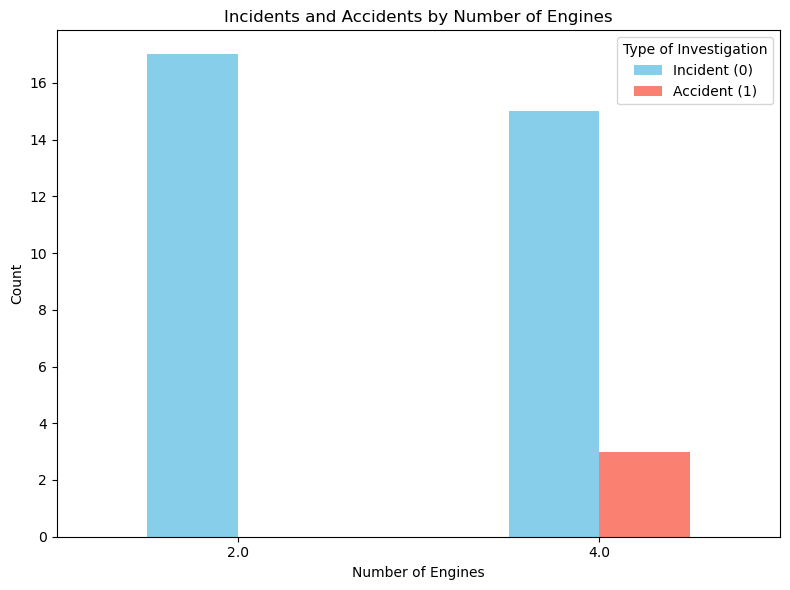

#  Cleared for Takeoff: A Data-Driven Risk Analysis for Strategic Aircraft Acquisition


## Overview
This project aims at analyzing data from the National Transportation Safety Board [Aviation accident database](https://www.kaggle.com/datasets/khsamaha/aviation-accident-database-synopses), which contains aviation accident records from 1962 to 2023, within the United States, its territories and possessions, and in international waters. The primary objective is to assess the safety of various aircraft to ensure our clients make well-informed and risk-conscious purchasing decisions as they expand into the aviation sector.


## Business Understanding
Our client is seeking to broaden their investment portfolio by entering new markets. They are particularly interested in acquiring and managing aircraft for both commercial and private use. As a data analyst, my objective is to identify the safest and most reliable aircraft options to support the company's entry into this aviation venture.


## Data Understanding
The dataset used in this analysis is sourced from Kaggle: [Aviation Accident Database & Synopses (up to 2023)](https://www.kaggle.com/datasets/khsamaha/aviation-accident-database-synopses). It contains detailed records of aviation accidents investigated by the U.S. National Transportation Safety Board (NTSB) from 1962 to 2023. This information allows for a comprehensive analysis of accident patterns, helping us determine which aircraft types have the lowest risk profiles. Specifically, we will assess factors such as the number of engines, aircraft condition prior to takeoff, and geographical locations with higher accident frequencies. The goal is to identify trends and safety indicators that can guide the company in selecting safer aircraft for commercial and private operations.


```python
# import pandas to load the data and create dataframes, we use pandas methods to inspect the shape and other attributes of these data frames
import pandas as pd
```


```python
#used encoding latin1 because maybe our data contains special characters that cannot be read with 'utf-8'
#load the csv file using alias pd
aircraft_data = pd.read_csv('AviationData.csv', encoding = 'latin1', low_memory=False)# tells pandas to read the whole file first then determine the best datatype for each column
aircraft_data.head()
```


<div>
<style scoped>
    .dataframe tbody tr th:only-of-type {
        vertical-align: middle;
    }

    .dataframe tbody tr th {
        vertical-align: top;
    }

    .dataframe thead th {
        text-align: right;
    }
</style>
<table border="1" class="dataframe">
  <thead>
    <tr style="text-align: right;">
      <th></th>
      <th>Event.Id</th>
      <th>Investigation.Type</th>
      <th>Accident.Number</th>
      <th>Event.Date</th>
      <th>Location</th>
      <th>Country</th>
      <th>Latitude</th>
      <th>Longitude</th>
      <th>Airport.Code</th>
      <th>Airport.Name</th>
      <th>...</th>
      <th>Purpose.of.flight</th>
      <th>Air.carrier</th>
      <th>Total.Fatal.Injuries</th>
      <th>Total.Serious.Injuries</th>
      <th>Total.Minor.Injuries</th>
      <th>Total.Uninjured</th>
      <th>Weather.Condition</th>
      <th>Broad.phase.of.flight</th>
      <th>Report.Status</th>
      <th>Publication.Date</th>
    </tr>
  </thead>
  <tbody>
    <tr>
      <th>0</th>
      <td>20001218X45444</td>
      <td>Accident</td>
      <td>SEA87LA080</td>
      <td>1948-10-24</td>
      <td>MOOSE CREEK, ID</td>
      <td>United States</td>
      <td>NaN</td>
      <td>NaN</td>
      <td>NaN</td>
      <td>NaN</td>
      <td>...</td>
      <td>Personal</td>
      <td>NaN</td>
      <td>2.0</td>
      <td>0.0</td>
      <td>0.0</td>
      <td>0.0</td>
      <td>UNK</td>
      <td>Cruise</td>
      <td>Probable Cause</td>
      <td>NaN</td>
    </tr>
    <tr>
      <th>1</th>
      <td>20001218X45447</td>
      <td>Accident</td>
      <td>LAX94LA336</td>
      <td>1962-07-19</td>
      <td>BRIDGEPORT, CA</td>
      <td>United States</td>
      <td>NaN</td>
      <td>NaN</td>
      <td>NaN</td>
      <td>NaN</td>
      <td>...</td>
      <td>Personal</td>
      <td>NaN</td>
      <td>4.0</td>
      <td>0.0</td>
      <td>0.0</td>
      <td>0.0</td>
      <td>UNK</td>
      <td>Unknown</td>
      <td>Probable Cause</td>
      <td>19-09-1996</td>
    </tr>
    <tr>
      <th>2</th>
      <td>20061025X01555</td>
      <td>Accident</td>
      <td>NYC07LA005</td>
      <td>1974-08-30</td>
      <td>Saltville, VA</td>
      <td>United States</td>
      <td>36.922223</td>
      <td>-81.878056</td>
      <td>NaN</td>
      <td>NaN</td>
      <td>...</td>
      <td>Personal</td>
      <td>NaN</td>
      <td>3.0</td>
      <td>NaN</td>
      <td>NaN</td>
      <td>NaN</td>
      <td>IMC</td>
      <td>Cruise</td>
      <td>Probable Cause</td>
      <td>26-02-2007</td>
    </tr>
    <tr>
      <th>3</th>
      <td>20001218X45448</td>
      <td>Accident</td>
      <td>LAX96LA321</td>
      <td>1977-06-19</td>
      <td>EUREKA, CA</td>
      <td>United States</td>
      <td>NaN</td>
      <td>NaN</td>
      <td>NaN</td>
      <td>NaN</td>
      <td>...</td>
      <td>Personal</td>
      <td>NaN</td>
      <td>2.0</td>
      <td>0.0</td>
      <td>0.0</td>
      <td>0.0</td>
      <td>IMC</td>
      <td>Cruise</td>
      <td>Probable Cause</td>
      <td>12-09-2000</td>
    </tr>
    <tr>
      <th>4</th>
      <td>20041105X01764</td>
      <td>Accident</td>
      <td>CHI79FA064</td>
      <td>1979-08-02</td>
      <td>Canton, OH</td>
      <td>United States</td>
      <td>NaN</td>
      <td>NaN</td>
      <td>NaN</td>
      <td>NaN</td>
      <td>...</td>
      <td>Personal</td>
      <td>NaN</td>
      <td>1.0</td>
      <td>2.0</td>
      <td>NaN</td>
      <td>0.0</td>
      <td>VMC</td>
      <td>Approach</td>
      <td>Probable Cause</td>
      <td>16-04-1980</td>
    </tr>
  </tbody>
</table>
<p>5 rows × 31 columns</p>
</div>


```python
#Check the data types for each columns
aircraft_data.info()
```

    <class 'pandas.core.frame.DataFrame'>
    RangeIndex: 88889 entries, 0 to 88888
    Data columns (total 31 columns):
     #   Column                  Non-Null Count  Dtype  
    ---  ------                  --------------  -----  
     0   Event.Id                88889 non-null  object 
     1   Investigation.Type      88889 non-null  object 
     2   Accident.Number         88889 non-null  object 
     3   Event.Date              88889 non-null  object 
     4   Location                88837 non-null  object 
     5   Country                 88663 non-null  object 
     6   Latitude                34382 non-null  object 
     7   Longitude               34373 non-null  object 
     8   Airport.Code            50132 non-null  object 
     9   Airport.Name            52704 non-null  object 
     10  Injury.Severity         87889 non-null  object 
     11  Aircraft.damage         85695 non-null  object 
     12  Aircraft.Category       32287 non-null  object 
     13  Registration.Number     87507 non-null  object 
     14  Make                    88826 non-null  object 
     15  Model                   88797 non-null  object 
     16  Amateur.Built           88787 non-null  object 
     17  Number.of.Engines       82805 non-null  float64
     18  Engine.Type             81793 non-null  object 
     19  FAR.Description         32023 non-null  object 
     20  Schedule                12582 non-null  object 
     21  Purpose.of.flight       82697 non-null  object 
     22  Air.carrier             16648 non-null  object 
     23  Total.Fatal.Injuries    77488 non-null  float64
     24  Total.Serious.Injuries  76379 non-null  float64
     25  Total.Minor.Injuries    76956 non-null  float64
     26  Total.Uninjured         82977 non-null  float64
     27  Weather.Condition       84397 non-null  object 
     28  Broad.phase.of.flight   61724 non-null  object 
     29  Report.Status           82505 non-null  object 
     30  Publication.Date        75118 non-null  object 
    dtypes: float64(5), object(26)
    memory usage: 21.0+ MB
    

# Info analysis
From the information above, the dataset contains a total of 88,889 entries and 31 columns. By reviewing an overview of the data, we can identify which columns contain null values and make informed decisions on which ones to retain or drop.
Now check the relevance of each column to our goal.


```python
# checking for the percentage of null values in each column
aircraft_data.isna().mean()*100
```


    Event.Id                   0.000000
    Investigation.Type         0.000000
    Accident.Number            0.000000
    Event.Date                 0.000000
    Location                   0.058500
    Country                    0.254250
    Latitude                  61.320298
    Longitude                 61.330423
    Airport.Code              43.601570
    Airport.Name              40.708074
    Injury.Severity            1.124999
    Aircraft.damage            3.593246
    Aircraft.Category         63.677170
    Registration.Number        1.554748
    Make                       0.070875
    Model                      0.103500
    Amateur.Built              0.114750
    Number.of.Engines          6.844491
    Engine.Type                7.982990
    FAR.Description           63.974170
    Schedule                  85.845268
    Purpose.of.flight          6.965991
    Air.carrier               81.271023
    Total.Fatal.Injuries      12.826109
    Total.Serious.Injuries    14.073732
    Total.Minor.Injuries      13.424608
    Total.Uninjured            6.650992
    Weather.Condition          5.053494
    Broad.phase.of.flight     30.560587
    Report.Status              7.181991
    Publication.Date          15.492356
    dtype: float64


# Dropping Columns

Columns such as `Air.carrier` have approximately 81% missing values, and `Schedule` has around 85% missing values. Let’s now evaluate their relevance to determine whether they should be retained or dropped from the dataset.


```python
#drop the Air.Carrier and schedule column due to its higher percentage of missing values
aircraft_data.drop(['Air.carrier','Schedule'], axis= 1, inplace=True)
```


```python
aircraft_data.info()
```

    <class 'pandas.core.frame.DataFrame'>
    RangeIndex: 88889 entries, 0 to 88888
    Data columns (total 29 columns):
     #   Column                  Non-Null Count  Dtype  
    ---  ------                  --------------  -----  
     0   Event.Id                88889 non-null  object 
     1   Investigation.Type      88889 non-null  object 
     2   Accident.Number         88889 non-null  object 
     3   Event.Date              88889 non-null  object 
     4   Location                88837 non-null  object 
     5   Country                 88663 non-null  object 
     6   Latitude                34382 non-null  object 
     7   Longitude               34373 non-null  object 
     8   Airport.Code            50132 non-null  object 
     9   Airport.Name            52704 non-null  object 
     10  Injury.Severity         87889 non-null  object 
     11  Aircraft.damage         85695 non-null  object 
     12  Aircraft.Category       32287 non-null  object 
     13  Registration.Number     87507 non-null  object 
     14  Make                    88826 non-null  object 
     15  Model                   88797 non-null  object 
     16  Amateur.Built           88787 non-null  object 
     17  Number.of.Engines       82805 non-null  float64
     18  Engine.Type             81793 non-null  object 
     19  FAR.Description         32023 non-null  object 
     20  Purpose.of.flight       82697 non-null  object 
     21  Total.Fatal.Injuries    77488 non-null  float64
     22  Total.Serious.Injuries  76379 non-null  float64
     23  Total.Minor.Injuries    76956 non-null  float64
     24  Total.Uninjured         82977 non-null  float64
     25  Weather.Condition       84397 non-null  object 
     26  Broad.phase.of.flight   61724 non-null  object 
     27  Report.Status           82505 non-null  object 
     28  Publication.Date        75118 non-null  object 
    dtypes: float64(5), object(24)
    memory usage: 19.7+ MB
    

# Making Sure columns We are interested in are Uniform and dealing with null values


## `Weather` Column


```python
aircraft_data['Weather.Condition'].value_counts()
```


    Weather.Condition
    VMC    77303
    IMC     5976
    UNK      856
    Unk      262
    Name: count, dtype: int64


From the above output `UNK` and `unk`are the same just diffrent capitalization. we make the uniform by `.str.upper()`method


```python
aircraft_data['Weather.Condition']=aircraft_data['Weather.Condition'].str.upper()
```

Filled the nan values with VMC since its the most frequent


```python
# filling the nan values with most frequent
aircraft_data['Weather.Condition']=aircraft_data['Weather.Condition'].fillna('VMC')
```

## `Make` Column


```python
#code to look at the unique types of Makes
aircraft_data['Make'].value_counts()
```


    Make
    Cessna             22227
    Piper              12029
    CESSNA              4922
    Beech               4330
    PIPER               2841
                       ...  
    Leonard Walters        1
    Maule Air Inc.         1
    Motley Vans            1
    Perlick                1
    ROYSE RALPH L          1
    Name: count, Length: 8237, dtype: int64


From the output above, `Cessna` and `CESSNA` refer to the same make, but with different capitalizations. We will standardize the `Make` column by applying the `.title()` method


```python
# making the names in Make be uniform 
aircraft_data['Make']=aircraft_data['Make'].str.title()

```

## `Purpose of flight` Column


```python
aircraft_data['Purpose.of.flight'].value_counts()
```


    Purpose.of.flight
    Personal                     49448
    Instructional                10601
    Unknown                       6802
    Aerial Application            4712
    Business                      4018
    Positioning                   1646
    Other Work Use                1264
    Ferry                          812
    Aerial Observation             794
    Public Aircraft                720
    Executive/corporate            553
    Flight Test                    405
    Skydiving                      182
    External Load                  123
    Public Aircraft - Federal      105
    Banner Tow                     101
    Air Race show                   99
    Public Aircraft - Local         74
    Public Aircraft - State         64
    Air Race/show                   59
    Glider Tow                      53
    Firefighting                    40
    Air Drop                        11
    ASHO                             6
    PUBS                             4
    PUBL                             1
    Name: count, dtype: int64


```python
aircraft_data['Purpose.of.flight'] =aircraft_data['Purpose.of.flight'].fillna('Personal')

```

Missing values in the `Purpose.of.flight` columns were filled with `Personal` since it was the most frequent category, representing the majority of the data 

## `Engine Type` Column


```python
aircraft_data['Engine.Type'].value_counts()
```


    Engine.Type
    Reciprocating      69530
    Turbo Shaft         3609
    Turbo Prop          3391
    Turbo Fan           2481
    Unknown             2051
    Turbo Jet            703
    Geared Turbofan       12
    Electric              10
    LR                     2
    NONE                   2
    Hybrid Rocket          1
    UNK                    1
    Name: count, dtype: int64


# Checking for Correlation betweeen Numeric Data
I was interested in checking whether `Amateur Built` is correlated with the `Type.Of.investigation`. To do this, I'll need to convert the columns to numeric format.


```python
#Change the amateur built into a numbers 
aircraft_data['Amateur.Built']=aircraft_data['Amateur.Built'].map({'Yes': 1, 'No':0})
```


```python
#Change the Investigation types to numbers 
aircraft_data['Investigation.Type']=aircraft_data['Investigation.Type'].map({'Accident': 1, 'Incident':0})
```


```python
#Checking correlation between numeric data
aircraft_data.corr(numeric_only=True)
```


<div>
<style scoped>
    .dataframe tbody tr th:only-of-type {
        vertical-align: middle;
    }

    .dataframe tbody tr th {
        vertical-align: top;
    }

    .dataframe thead th {
        text-align: right;
    }
</style>
<table border="1" class="dataframe">
  <thead>
    <tr style="text-align: right;">
      <th></th>
      <th>Investigation.Type</th>
      <th>Amateur.Built</th>
      <th>Number.of.Engines</th>
      <th>Total.Fatal.Injuries</th>
      <th>Total.Serious.Injuries</th>
      <th>Total.Minor.Injuries</th>
      <th>Total.Uninjured</th>
    </tr>
  </thead>
  <tbody>
    <tr>
      <th>Investigation.Type</th>
      <td>1.000000</td>
      <td>0.061804</td>
      <td>-0.370518</td>
      <td>0.024367</td>
      <td>0.025172</td>
      <td>-0.000623</td>
      <td>-0.348089</td>
    </tr>
    <tr>
      <th>Amateur.Built</th>
      <td>0.061804</td>
      <td>1.000000</td>
      <td>-0.106847</td>
      <td>-0.012407</td>
      <td>-0.001795</td>
      <td>-0.003396</td>
      <td>-0.049998</td>
    </tr>
    <tr>
      <th>Number.of.Engines</th>
      <td>-0.370518</td>
      <td>-0.106847</td>
      <td>1.000000</td>
      <td>0.098505</td>
      <td>0.046157</td>
      <td>0.098162</td>
      <td>0.406058</td>
    </tr>
    <tr>
      <th>Total.Fatal.Injuries</th>
      <td>0.024367</td>
      <td>-0.012407</td>
      <td>0.098505</td>
      <td>1.000000</td>
      <td>0.135724</td>
      <td>0.073559</td>
      <td>-0.015214</td>
    </tr>
    <tr>
      <th>Total.Serious.Injuries</th>
      <td>0.025172</td>
      <td>-0.001795</td>
      <td>0.046157</td>
      <td>0.135724</td>
      <td>1.000000</td>
      <td>0.326849</td>
      <td>0.052869</td>
    </tr>
    <tr>
      <th>Total.Minor.Injuries</th>
      <td>-0.000623</td>
      <td>-0.003396</td>
      <td>0.098162</td>
      <td>0.073559</td>
      <td>0.326849</td>
      <td>1.000000</td>
      <td>0.147770</td>
    </tr>
    <tr>
      <th>Total.Uninjured</th>
      <td>-0.348089</td>
      <td>-0.049998</td>
      <td>0.406058</td>
      <td>-0.015214</td>
      <td>0.052869</td>
      <td>0.147770</td>
      <td>1.000000</td>
    </tr>
  </tbody>
</table>
</div>


Cheking the correlation between numeric data there are negative correlations and weak corelation

# Cheking the Frequencies of Damages


```python
#checking type of damages 
damage_counts=aircraft_data['Aircraft.damage'].value_counts()
```


```python
# import matplotlib to draw graph and shows a plot inside Jupyter notebook
import matplotlib.pyplot as plt
%matplotlib inline
```


```python
plt.bar(damage_counts.index, damage_counts.values,edgecolor='black', color= 'violet')
plt.xlabel('Aircraft damage')
plt.ylabel('Frequency of damages')
plt.title(' Frequencies of damages')
plt.show()
```


    

    


## Creating a DataFrame with minor damages only


```python
minor_damage_df= aircraft_data[aircraft_data['Aircraft.damage']=='Minor'].copy()
```

## Variable of makes with minor Damages


```python
#create a variable that shows how many times each aircraft had a minor damage
Makes_with_minor_damage= minor_damage_df['Make'].value_counts()
Makes_with_minor_damage
```


    Make
    Boeing               711
    Cessna               387
    Piper                204
    Beech                170
    Mcdonnell Douglas    162
                        ... 
    Fitz                   1
    Aviat                  1
    Avian                  1
    Buchmann               1
    Diamond Aircraft       1
    Name: count, Length: 314, dtype: int64


```python
# bar chart to show makes with lower damages
top_makes = Makes_with_minor_damage.head(10)
plt.figure(figsize=(10,6))
plt.bar(top_makes.index, top_makes.values,edgecolor='black')
plt.xlabel('Aircraft Make ')
plt.ylabel('Number of Minor Damages')
plt.title('Top 10 Aircraft Makes with Minor Damage')
plt.show()
```


    

    


Based on the graph, Boeing appears to be the most favorable make to consider, as it is associated with a lower risk, indicated by a higher number of incidents involving only minor damage.
This suggests that Boeing aircraft may be more durable or better equipped to withstand incidents with minimal impact, making them a potentially safer investment for the company’s entry into the aviation industry.

## Creating A Variable of Models with Minor Damage


```python
# crate a variable that shows the model with minor damages
Model_with_minor_damage= minor_damage_df['Model'].value_counts()
Model_with_minor_damage
```


    Model
    737            124
    747             38
    777             32
    152             29
    402C            24
                  ... 
    180C             1
    182-P            1
    AA-5B            1
    A-300-605R       1
    BD-700-2A12      1
    Name: count, Length: 1366, dtype: int64


```python
# Bar chart to indicate models with minor damanges
top_models= Model_with_minor_damage.head(10)
plt.figure(figsize=(10,6))
plt.bar(top_models.index, top_models.values,edgecolor='black',color='orange')
plt.xlabel('Aircraft Model ')
plt.ylabel('Number of Minor Damages')
plt.title('Top 10 Aircraft Models with Minor Damage')
plt.show()
```


    

    


From the graph above, the 737 model has the highest number of minor damage incidents, making it the most promising option for the company to consider. 
Now we we will choose the make and the model with the highest number of minor Damages to be aour best option to consider


```python
# create a dataframe with make being boeing and model 737
aircraft_minor_risk_df=minor_damage_df[(minor_damage_df['Make']== 'Boeing') & (minor_damage_df['Model']=='737')].copy()
```

## Checking Engine Type


```python
#Checking the number of unique engine types
aircraft_minor_risk_df['Engine.Type'].value_counts()
```


    Engine.Type
    Turbo Fan    8
    Name: count, dtype: int64


```python
## fill the non values with Turbo Fan
aircraft_minor_risk_df['Engine.Type']=aircraft_minor_risk_df['Engine.Type'].fillna('Turbo Fan')
```


```python
## fill the non values with Turbo Fan
minor_damage_df.loc[(minor_damage_df['Make']=='Boeing') & (minor_damage_df['Engine.Type'].isna() & minor_damage_df['Model']=='737'),'Engine.Type']= 'Turbo Fan'
```


We have filled the missing values `Engine.Type` with `Turbo Fan` based on research confirming that the Boeing 737 uses the Turbo fan engine [Boeing 737](https://en.wikipedia.org/wiki/Boeing_737?utm_source) . 

# Number of engines


```python
#Checking the number of enginees our safe aircraft should have 
aircraft_minor_risk_df['Number.of.Engines'].value_counts()
```


    Number.of.Engines
    2.0    30
    Name: count, dtype: int64


```python
aircraft_minor_risk_df['Number.of.Engines']=aircraft_minor_risk_df['Number.of.Engines'].fillna(2.0)
```

Missing values in the Number.of.Engines column have been filled with 2.0, based on verified information from [Wikipedia](https://en.wikipedia.org/wiki/Boeing_737_Next_Generation#:~:text=The%20Boeing%20737%20Next%20Generation,has%20been%20produced%20since%201997.&text=The%20737%2D800%20is%20the%20best%2Dselling%20737NG%20variant.), which confirms that all Boeing 737 aircraft are equipped with two engines. This imputation ensures data consistency and aligns with the known specifications of the aircraft model.

## Weather Condition with Higher number of damages 


```python
aircraft_minor_risk_df['Weather.Condition'].value_counts()
```


    Weather.Condition
    VMC    121
    IMC      2
    UNK      1
    Name: count, dtype: int64


A number of incidents occurred under favorable weather conditions `VMC`. This suggests that weather may not have been the primary contributing factor in these cases. Further analysis is needed to explore other contributing factors such as pilot experience, mechanical failure, or maintenance history."

## Getting the report and cause of accident/Incident


```python
#using list comprehension to get reports 
unique_reports= [print(report) for  report in (aircraft_minor_risk_df['Report.Status'].dropna())]
unique_reports
```

    The failure of the MLG was due to cracking in the cylinder wall resulting from a fatigue mechanism which initiated at, and near the inner diameter (ID) surface, with propagation through the wall toward the outer diameter(OD) surface. Crack initiation was due to base metal damage which took the form of over tempered martensite (OTM) and chemical attack/pitting of the base metal.
    The right nose landing gear axle's failure from intergranular and fatigue cracking due to an earlier bearing failure.
    The pilot's inadvertent application of excessive braking after touchdown, which caused the right wheels to lock and several tires to blow and resulted in a subsequent brake fire.
    The failure of the right main landing gear inboard axle due to fatigue cracking as a result of fretting damage in one of the brake mounting bolt holes.
    <br /><br />
    <br /><br />
    <br /><br />
    <br /><br />
    The gate lead/pushback driver's failure to recognize that the provisioning truck was within the safety zone of the gate during his walkaround due to distractions, which resulted in the subsequent collision between the airplane and the truck. Contributing to the collision was the provisioning truck driver's failure to recognize he was parked in the safety zone of an active gate adjacent to his assigned gate, and the guide agent's improper assumption that the safety zone was properly cleared by the gate lead/pushback driver.
    N925NN flight crew's incorrect evaluation of the clearance between the two aircraft, leading to the inadvertent collision of the winglet with the horizontal stabilizer and elevator of N784SW.
    


    [None, None, None, None, None, None, None, None, None, None]


```python
aircraft_minor_risk_df['Purpose.of.flight'].value_counts()
```


    Purpose.of.flight
    Personal    123
    Business      1
    Name: count, dtype: int64


```python
aircraft_minor_risk_df['Purpose.of.flight']=aircraft_minor_risk_df['Purpose.of.flight'].replace('Personal', 'Business')

```

Reason for this, after doing research The boring 737 is commercial airliner designed and manufuctured by the Boeng Company. More info on this  [Boeing 737](https://www.ebsco.com/research-starters/science/boeing-737#:~:text=Boeing%20737-,The%20Boeing%20737%20is%20a%20twinjet%20narrow%2Dbody%20commercial%20airliner,history%20of%20commercial%20air%20travel.)


```python
# change the 'Event.date' to a datetime format
aircraft_minor_risk_df['Event.Date']=pd.to_datetime(aircraft_minor_risk_df['Event.Date'])
# Extract the year
aircraft_minor_risk_df['Event.Year'] = aircraft_minor_risk_df['Event.Date'].dt.year
# filter for incidents only
incidents_df=aircraft_minor_risk_df[aircraft_minor_risk_df['Investigation.Type'] ==0]
#count incidents per year
incidents_per_year= incidents_df['Event.Year'].value_counts().sort_index()
#plot
fig, ax =plt.subplots(figsize=(10,6))
incidents_per_year.plot(kind='line', ax=ax, marker = 'o') 
ax.set_xlabel('Year')
ax.set_ylabel('Number of Incidents')
ax.set_title('Number of incidents over the years')
plt.show()
```


    

    


The highest incidents were in 2017 and 2019

## Checking best Aircraft for Personal purposes


```python
accidents_df=aircraft_minor_risk_df[aircraft_minor_risk_df['Investigation.Type'] ==1]
#count incidents per year
accidents_per_year= accidents_df['Event.Year'].value_counts().sort_index()
#plot
fig, ax =plt.subplots(figsize=(10,6))
accidents_per_year.plot(kind='barh', ax=ax,color='blue') 
ax.set_xlabel('Year')
ax.set_ylabel('Number of accidents')
ax.set_title('Number of accidents over the years')
plt.show()
```


    

    


The number of accident seem to occur concurrently in the year 2017,2018 and 2019. We can do research to know what changes were made that maybe caused this consistent accidents

## Creating a data frame with Purpose of flight being `Personal`

Applying changes made to our Boeing 737 to the `minor_damage_df` DataFrame


```python
minor_damage_df.loc[(minor_damage_df['Make']=='Boeing') & (minor_damage_df['Engine.Type'].isna() & minor_damage_df['Model']=='737'),'Engine.Type']= 'Turbo Fan'
```


```python
minor_damage_df.loc[(minor_damage_df['Make']=='Boeing') & (minor_damage_df['Model']=='737'),'Purpose.of.flight']= 'Business'
```


```python
minor_damage_df.loc[(minor_damage_df['Make']=='Boeing') & (minor_damage_df['Number.of.Engines'].isna()),'Number.of.Engines']= 2.0
```


```python
minor_personal_damage=minor_damage_df[minor_damage_df['Purpose.of.flight']=='Personal']
```


```python
# Checking personal aircraft with minor damages
minor_personal_damage['Make'].value_counts()
```


    Make
    Boeing      292
    Cessna      181
    Piper        83
    Beech        61
    Airbus       58
               ... 
    Aviat         1
    Avian         1
    Buchmann      1
    Franz         1
    Ayres         1
    Name: count, Length: 226, dtype: int64


```python
#Model with  minor damages
minor_personal_damage['Model'].value_counts()
```


    Model
    747            35
    777            30
    CL-600-2B19    17
    767            15
    757            13
                   ..
    200C            1
    CL600-2B19      1
    747-100         1
    T6G             1
    BD-700-2A12     1
    Name: count, Length: 759, dtype: int64


Dataframe with Make being `Boeing` and model `747`


```python
personal_747_df=minor_personal_damage[(minor_personal_damage['Model']== '747') & (minor_personal_damage['Make']=='Boeing')].copy()
```


```python
#Checking The type of engine
personal_747_df['Engine.Type'].value_counts()
```


    Engine.Type
    Turbo Fan    10
    Name: count, dtype: int64


```python
personal_747_df['Engine.Type']=personal_747_df['Engine.Type'].fillna('Turbo Fan')
```

Reason for this is Boeing 747 uses Turbo Fan. More info in [Boeing 747 Design](https://www.boeing.com/commercial/747-8/design-highlights#technologically-advanced)


```python
#Checking Number of Engines 
personal_747_df['Number.of.Engines'].value_counts()
```


    Number.of.Engines
    4.0    18
    2.0    17
    Name: count, dtype: int64


```python
# getting the number of engines with the type of accident/incident
personal_747_df[['Number.of.Engines','Investigation.Type']].value_counts()
```


    Number.of.Engines  Investigation.Type
    2.0                0                     17
    4.0                0                     15
                       1                      3
    Name: count, dtype: int64


From the above output we can conclude that both the Turbo Fan with 2 engines and 4 engines are safe. Shows that incidents are more frequent than accidents which is possibly a good sign for aviation safety


```python
# Step 1: Group and count combinations of Engine count vs Type of investigation
engine_investigation_counts = personal_747_df.groupby(['Number.of.Engines', 'Investigation.Type']).size().unstack(fill_value=0)

# Step 2: Rename the columns for clarity
engine_investigation_counts.columns = ['Incident (0)', 'Accident (1)']

# Step 3: Plot using fig and ax
fig, ax = plt.subplots(figsize=(8, 6))
engine_investigation_counts.plot(kind='bar', ax=ax, color=['skyblue', 'salmon'])

# Step 4: Customize the plot
ax.set_title('Incidents and Accidents by Number of Engines')
ax.set_xlabel('Number of Engines')
ax.set_ylabel('Count')
ax.legend(title='Type of Investigation')
ax.set_xticklabels(engine_investigation_counts.index.astype(str), rotation=0)

# Step 5: Show the plot
plt.tight_layout()
plt.show()


```


    

    


This also confirms the above observation that a missing engine may be associated with higherr risk.


```python
personal_747_df.head()
```


<div>
<style scoped>
    .dataframe tbody tr th:only-of-type {
        vertical-align: middle;
    }

    .dataframe tbody tr th {
        vertical-align: top;
    }

    .dataframe thead th {
        text-align: right;
    }
</style>
<table border="1" class="dataframe">
  <thead>
    <tr style="text-align: right;">
      <th></th>
      <th>Event.Id</th>
      <th>Investigation.Type</th>
      <th>Accident.Number</th>
      <th>Event.Date</th>
      <th>Location</th>
      <th>Country</th>
      <th>Latitude</th>
      <th>Longitude</th>
      <th>Airport.Code</th>
      <th>Airport.Name</th>
      <th>...</th>
      <th>FAR.Description</th>
      <th>Purpose.of.flight</th>
      <th>Total.Fatal.Injuries</th>
      <th>Total.Serious.Injuries</th>
      <th>Total.Minor.Injuries</th>
      <th>Total.Uninjured</th>
      <th>Weather.Condition</th>
      <th>Broad.phase.of.flight</th>
      <th>Report.Status</th>
      <th>Publication.Date</th>
    </tr>
  </thead>
  <tbody>
    <tr>
      <th>4150</th>
      <td>20001214X42478</td>
      <td>0</td>
      <td>LAX83IA149A</td>
      <td>1983-03-18</td>
      <td>LOS ANGELES, CA</td>
      <td>United States</td>
      <td>NaN</td>
      <td>NaN</td>
      <td>LAX</td>
      <td>LOS ANGELES INTL</td>
      <td>...</td>
      <td>Part 129: Foreign</td>
      <td>Personal</td>
      <td>NaN</td>
      <td>NaN</td>
      <td>NaN</td>
      <td>588.0</td>
      <td>VMC</td>
      <td>Taxi</td>
      <td>Probable Cause</td>
      <td>04-12-2014</td>
    </tr>
    <tr>
      <th>52199</th>
      <td>20090625X31711</td>
      <td>0</td>
      <td>DCA02RA024</td>
      <td>2002-03-01</td>
      <td>Sydney, Australia</td>
      <td>Australia</td>
      <td>NaN</td>
      <td>NaN</td>
      <td>SDY</td>
      <td>Sydney</td>
      <td>...</td>
      <td>Non-U.S., Commercial</td>
      <td>Personal</td>
      <td>NaN</td>
      <td>NaN</td>
      <td>NaN</td>
      <td>NaN</td>
      <td>VMC</td>
      <td>NaN</td>
      <td>Foreign</td>
      <td>07-07-2009</td>
    </tr>
    <tr>
      <th>60171</th>
      <td>20090617X33239</td>
      <td>0</td>
      <td>ENG06WA009</td>
      <td>2006-02-01</td>
      <td>Istanbul, Turkey</td>
      <td>Turkey</td>
      <td>NaN</td>
      <td>NaN</td>
      <td>IST</td>
      <td>Istanbul, Turkey</td>
      <td>...</td>
      <td>Non-U.S., Commercial</td>
      <td>Personal</td>
      <td>NaN</td>
      <td>NaN</td>
      <td>NaN</td>
      <td>NaN</td>
      <td>VMC</td>
      <td>NaN</td>
      <td>Foreign</td>
      <td>29-06-2009</td>
    </tr>
    <tr>
      <th>64387</th>
      <td>20081003X63355</td>
      <td>0</td>
      <td>ENG08IA022</td>
      <td>2008-04-20</td>
      <td>Newark, NJ</td>
      <td>United States</td>
      <td>404427N</td>
      <td>0741014W</td>
      <td>EWR</td>
      <td>Newark Liberty International</td>
      <td>...</td>
      <td>121</td>
      <td>Personal</td>
      <td>0.0</td>
      <td>0.0</td>
      <td>0.0</td>
      <td>5.0</td>
      <td>VMC</td>
      <td>NaN</td>
      <td>An engine fire in the No. 3 engine due to the ...</td>
      <td>25-09-2020</td>
    </tr>
    <tr>
      <th>67558</th>
      <td>20100106X21356</td>
      <td>0</td>
      <td>ENG10RA009</td>
      <td>2009-12-17</td>
      <td>Changi Airport, Senegal</td>
      <td>Senegal</td>
      <td>NaN</td>
      <td>NaN</td>
      <td>NaN</td>
      <td>NaN</td>
      <td>...</td>
      <td>NUSC</td>
      <td>Personal</td>
      <td>0.0</td>
      <td>0.0</td>
      <td>0.0</td>
      <td>0.0</td>
      <td>VMC</td>
      <td>NaN</td>
      <td>NaN</td>
      <td>03-11-2020</td>
    </tr>
  </tbody>
</table>
<p>5 rows × 29 columns</p>
</div>


```python
# plot of the accidents over the years 
# change the 'Event.date' to a datetime format
personal_747_df['Event.Date']=pd.to_datetime(personal_747_df['Event.Date'])
# Extract the year
personal_747_df['Event.Year'] = personal_747_df['Event.Date'].dt.year
# filter for incidents only
incidents_df=personal_747_df[personal_747_df['Investigation.Type'] ==0]
#count incidents per year
incidents_per_year= incidents_df['Event.Year'].value_counts().sort_index()
#plot
fig, ax =plt.subplots(figsize=(10,6))
incidents_per_year.plot(kind='barh', ax=ax,color='lightblue') 
ax.set_xlabel('Year')
ax.set_ylabel('Number of Incidents')
ax.set_title('Number of incidents over the years')
plt.show()
```


    

    


2010 had the highest number of incidents at 12. This has leptokurtic distitribution
